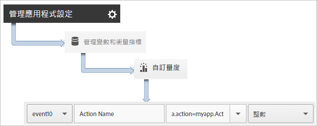

# 追蹤應用程式動作 {#track-app-actions}

動作為發生在您要測量之 Android 應用程式中的事件。

每個動作有一或多個對應量度，會隨著每次事件發生而增量。例如，您可能會針對每個新訂閱、每次檢視文章或每次完成某個層級時，傳送 `trackAction` 呼叫。應用程式不會自動追蹤動作，因次您必須在要追蹤的事件發生時呼叫 `trackAction`，然後將動作對應至自訂事件。

## Tracking actions {#section_380DF56C4EE4432A823940E4AE4C9E91}

1. 新增資料庫至您的專案與實施生命週期。

   如需詳細資訊，請參閱 *核心實作與生命週期* 中 [的新增SDK和設定檔案至IntelliJ IDEA或Eclipse專案](/help/android/getting-started/dev-qs.md)。

1. 匯入資料庫:

   ```java
   import com.adobe.mobile.*;
   ```

1. 當您要追蹤的動作在應用程式中發生時，請針對此動作呼叫 `trackAction` 以傳送點擊:

   ```java
   Analytics.trackAction("myapp.ActionName", null);
   ```

1. In the Adobe Mobile Services UI, select your app and click **[!UICONTROL Manage App Settings]**.
1. 按一下&#x200B;**[!UICONTROL 「管理變數和衡量指標」]**，然後按一下&#x200B;**「自訂量度」]標籤。[!UICONTROL **

1. 將程式碼中定義的內容資料名稱 (例如，`myapp.ActionName`) 對應至某個自訂事件。

   

You can also set a prop to hold all action values by mapping a custom prop with a name like **[!UICONTROL Custom Actions]** and setting the value to `a.action`.


## Sending additional data {#section_3EBE813E54A24F6FB669B2478B5661F9}

除了動作名稱之外，您還可以隨著每次追蹤動作呼叫傳送其他內容資料:

```java
HashMap<String, Object> exampleContextData = new HashMap<String, Object>(); 
exampleContextData.put("myapp.social.SocialSource", "Twitter"); 
Analytics.trackAction("myapp.SocialShare", exampleContextData);
```

內容資料值必須對應至 Adobe Mobile Services 中的自訂變數:


## Action reporting {#section_0F6A54AB7A3F42C9BB042D86A0FC4630}

| 介面 | 報告 |
|--- |--- |
| Adobe Mobile Services | ****&#x200B;動作路徑報表.  檢視動作於應用程式中發生的順序。您也可以按一下任一報表上的&#x200B;**[!UICONTROL 「自訂」]，以檢視動作的排名、趨勢或在劃分報表中的情況，或套用篩選條件以檢視特定區段的動作。** |
| Marketing Reports &amp; Analytics | **[!UICONTROL 「自訂事件」]**&#x200B;報表。當動作對應至自訂事件後，您可以檢視與所有其他 Analytics 事件類似的行動事件。 |
| Ad hoc analytics | **[!UICONTROL 「自訂事件」]**&#x200B;報表。當動作對應至自訂事件後，您可以檢視與所有其他 Analytics 事件類似的行動事件。 |

