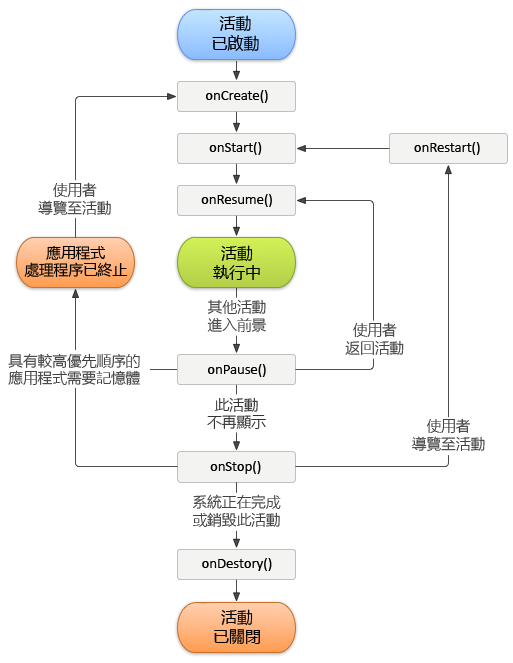

# 追蹤應用程式當機 {#track-app-crashes}

此資訊可協助您了解當機追蹤方式，以及處理錯誤當機的最佳實務。

>[!TIP]
>
>生命週期量度過程中會追蹤應用程式當機。您需要先將資料庫新增至您的專案並實施生命週期，才能追蹤當機。如需詳細資訊，請參閱[核心實施與生命週期](/help/android/getting-started/dev-qs.md)中的&#x200B;*新增 SDK 和設定檔案至您的 IntelliJ IDEA 或 Eclipse 專案*。

實施生命週期量度時，會呼叫各活動之 `Config.collectLifecycleData` 方法中的 `OnResume`。在 `onPause` 方法中，會呼叫 `Config.pauseCollectingLifeCycleData`。

在 `pauseCollectingLifeCycleData` 中，會設定標記指示順利結束。當應用程式重新啟動或繼續執行時，`collectLifecycleData` 會檢查此標記。如果應用程式並未依標記狀態判定為順利結束，則會傳送 `a.CrashEvent` 內容資料與下個呼叫，並回報當機事件。

若要確認當機報告準確，您必須呼叫各活動之 `pauseCollectingLifeCycleData` 方法中的 `onPause`。若要瞭解此為至關重要的原因，以下是 Android 活動生命週期的圖說。



如需有關 Android 活動生命週期的詳細資訊，請參閱[活動](https://developer.android.com/guide/components/activities.html)。

*此 Android 生命週期圖說是由[Android Open Source Project 建立和共用](https://source.android.com/)，並根據[Creative Commons 2.5 屬性授權](https://creativecommons.org/licenses/by/2.5/)中的條款來使用。*

## 導致回報錯誤當機的原因為何?

1. 如果您正使用 IDE (例如 Android Studio) 進行偵錯，當應用程式於前景執行時，從 IDE 重新啟動應用程式會造成當機。

   >[!TIP]
   >
   >您可以讓應用程式在背景執行，再從 IDE 重新啟動應用程式，即可避免出現此當機情況。

1. 如果應用程式的最後一個前景活動進入背景執行，但未在 `onPause` 中呼叫 `Config.pauseCollectingLifecycleData();`，而您的應用程式遭到手動關閉或作業系統逕行終止時，則在下次啟動應用程式時就會造成當機情況。

## 該如何處理片段?

各片段中皆有與活動類似的應用程式生命週期事件。然而，如果片段未連接至活動，則無法使用。

>[!IMPORTANT]
>
>您需要仰賴生命週期事件，讓容納活動可針對其執行您的程式碼。這將由片段的上層檢視處理。

## (選用) 實施活動生命週期回撥

自 API Level 14 開始，Android 允許活動的全域生命週期回撥。如需詳細資訊，請參閱[應用程式](https://developer.android.com/reference/android/app/Application)。

您可以使用這些回撥確保所有活動皆正確呼叫 `collectLifecycleData()` 和 `pauseCollectingLifecycleData()`。您僅需要將此程式碼新增至應用程式可能會在其中啟動的主要活動與任何其他活動:

```js
import com.adobe.mobile.Config; 
  
public class MainActivity extends Activity { 
... 
    @Override 
    protected void onCreate(Bundle savedInstanceState) { 
        super.onCreate(savedInstanceState); 
        setContentView(R.layout.activity_main); 
  
        getApplication().registerActivityLifecycleCallbacks(new Application.ActivityLifecycleCallbacks() { 
            @Override 
            public void onActivityResumed(Activity activity) { 
                Config.setContext(activity.getApplicationContext()); 
                Config.collectLifecycleData(activity); 
            } 
  
            @Override 
            public void onActivityPaused(Activity activity) {     
                Config.pauseCollectingLifecycleData(); 
            } 
    
            // the following methods aren't needed for our lifecycle purposes, but are required to be implemented 
            // by the ActivityLifecycleCallbacks object 
            @Override 
            public void onActivityCreated(Activity activity, Bundle savedInstanceState) {} 
            @Override 
            public void onActivityStarted(Activity activity) {} 
            @Override 
            public void onActivityStopped(Activity activity) {} 
            @Override 
            public void onActivitySaveInstanceState(Activity activity, Bundle outState) {} 
            @Override 
            public void onActivityDestroyed(Activity activity) {} 
        }); 
    } 
... 
}
```

若要藉由使用 `Config.collectLifecycleData(Activity activity`、`Map<String` 及 `Object> contextData)` 透過您的生命週期呼叫傳送其他內容資料，您必須針對該活動覆寫 `onResume` 方法，並務必在手動呼叫 `collectLifecycleData` 後呼叫 `super.onResume()`。

```js
@Override 
protected void onResume() { 
    HashMap<String, Object> cdata = new HashMap<>(); 
    cdata.put("someKey", "someValue"); 
    Config.collectLifecycleData(this, cdata); 
  
    super.onResume(); 
}
```

