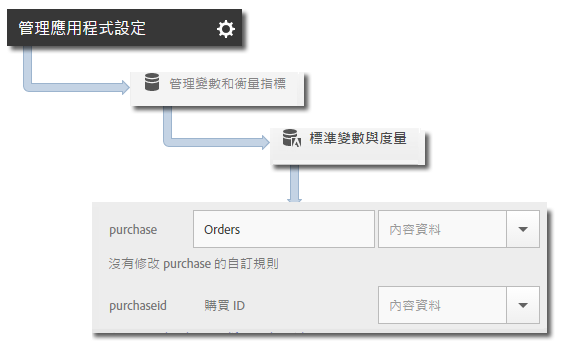

# 產品變數 {#products-variable}

無法使用處理規則來設定產品變數。 在Mobile SDK中，您必須在上下文資料參數中使用特殊語法，才能在伺服器呼叫上設定產品。

若要設定&#x200B;*產品*&#x200B;變數，請將內容資料索引鍵設為 `"&&products"`，並使用針對&#x200B;*產品*&#x200B;變數定義的語法來設定值:

```java
cdata.put("&&products", "Category;Product;Quantity;Price[,Category;Product;Quantity;Price]");
```

例如:

```java
//create a context data dictionary 
HashMap cdata = new HashMap<String, Object>(); 
 
// add products, a purchase id, a purchase context data key, and any other data you want to collect. 
// Note the special syntax for products 
cdata.put("&&products", ";Running Shoes;1;69.95,;Running Socks;10;29.99"); 
cdata.put("myapp.purchase", "1"); 
cdata.put("myapp.purchaseid", "1234567890"); 
 
// send the tracking call - use either a trackAction or TrackState call. 
// trackAction example: 
Analytics.trackAction("purchase", cdata); 
// trackState example: 
Analytics.trackState("Order Confirmation", cdata);
```

*產品*&#x200B;變數是直接在影像要求上設定的，而其他變數則設為內容資料。必須使用處理規則來映射所有上下文資料變數：



您不需要使用處理規 *則來映射產品變數* ，因為此變數是由SDK直接在影像要求上設定。
