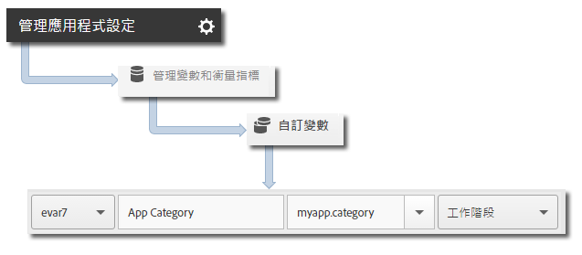

# 核心實施與生命週期 {#core-implementation-and-lifecycle}

此資訊可協助您實施 Android 資料庫並收集生命週期量度 (例如: 啟動、升級、工作階段、參與的使用者等等)。

## 下載 SDK {#section_99FE1A17A36D4A2C943939023CF6265C}

>[!IMPORTANT]
>
>若要下載 SDK，您必須使用 Android 2.2 或更新版本。

1. 請完成下列章節中的步驟，以設定開發報表套裝並下載預先填入版本的設定檔案：

   * [建立報表套裝](/help/android/getting-started/requirements.md)
   * [下載 SDK](/help/android/getting-started/requirements.md)

1. 下載並解壓縮 `[Your_App_Name_]AdobeMobileLibrary-4.*-Android.zip` 檔案，然後確認您有下列軟體元件:

   * `adobeMobileLibrary.jar`，此元件為搭配 Android 裝置和模擬器使用的資料庫。

   * `ADBMobileConfig.json`，此元件為根據您應用程式自訂的 SDK 設定檔案。
   >[!IMPORTANT]
   >
   >如果您在 Adobe Mobile Services 使用者介面以外的地方下載 SDK，則必須手動設定 `ADBMobileConfig.json` 檔案。如果您是初次使用 Analytics 和 Mobile SDK，並且想設定開發報表套裝和下載預先填入版本的設定檔案，請參閱[開始之前](/help/android/getting-started/requirements.md)。

## 新增 SDK 和設定檔案至您的 IntelliJ IDEA 或 Eclipse 專案 {#section_B89510FBB4C646AEA73A185B966E54D3}

**IntelliJ IDEA 專案**

新增 SDK 和設定檔案至您的專案:

1. 將 `ADBMobileConfig.json` 檔案新增至專案中的 `assets` 資料夾。

1. 在專案導覽面板中，以滑鼠右鍵按一下您的專案。
1. 選取&#x200B;**[!UICONTROL 開啟模組設定]**。
1. 在&#x200B;**[!UICONTROL 專案設定]**&#x200B;下，選取&#x200B;**[!UICONTROL 資料庫]**。
1. Click the **[!UICONTROL +]** icon to add a new library.
1. 選取 **[!UICONTROL Java]** 並導覽至 `adobeMobileLibrary.jar` 檔案。
1. 選取您計劃使用行動資料庫所在的模組。
1. 按一下&#x200B;**[!UICONTROL 「套用」]**&#x200B;與&#x200B;**[!UICONTROL 「確定」]**，以關閉「模組設定」視窗。

**Eclipse 專案**

新增 SDK 和設定檔案至您的專案:

1. 將 `ADBMobileConfig.json` 檔案新增至專案中的 `assets` 資料夾。
1. 在 **[!UICONTROL Eclipse IDE]** 中，以滑鼠右鍵按一下專案名稱。
1. Click  **[!UICONTROL Build Path]** > **[!UICONTROL Add External Archives]**.
1. 選擇 `adobeMobileLibrary.jar`.
1. 按一下&#x200B;**[!UICONTROL 開啟]**。
1. Right-click the project again and select **[!UICONTROL Build Path]** > **[!UICONTROL Configure Build Path]**.
1. 在&#x200B;**[!UICONTROL 「排序和匯出」]**&#x200B;標籤上，確認已選取 **`adobeMobileLibrary.jar`**。

## 新增應用程式權限 {#section_2EAF73ABF6424647B219A63B33B02CD5}

AppMeasurement 資料庫需要下列權限，才能傳送資料及記錄離線追蹤呼叫:

* `INTERNET`
* `ACCESS_NETWORK_STATE`

若要新增這些權限，請在位於應用程式專案目錄的 `AndroidManifest.xml` 檔案中新增下列行:

```java
<uses-permission android:name="android.permission.INTERNET" /> 
<uses-permission android:name="android.permission.ACCESS_NETWORK_STATE" />
```

## 設定應用程式內容 {#set-application-context}

您應在主要活動的 `onCreate` 方法中新增下列程式碼:

```java
   @Override
   public void onCreate(BundlesavedInstanceState){
     super.onCreate(savedInstanceState)
     setContentView(R.layout.main);
     Config.setContext(this.getApplicationContext());
   }
```

## 實施生命週期量度 {#section_BA686C09021F474AADDE8690BBB910F7}

啟用生命週期後，每當您的應用程式啟動時，就會傳送一次點擊以測量啟動數、升級數、工作階段數、參與使用者數，以及許多其他量度。如需詳細資訊，請參閱[生命週期量度](/help/android/metrics.md)。

**在應用程式的每個活動中完成下列步驟：**

1. 匯入資料庫:

   ```java
   import com.adobe.mobile.*;
   ```

1. 在 `onResume` 函式中，啟動生命週期資料集合:

   ```java
   @Override 
   public void onResume() { 
       Config.collectLifecycleData(this); 
       // -or- Config.collectLifecycleData(this, contextData); 
   }
   ```

1. 在 `onPause` 函式中，暫停生命週期資料集合:

   ```java
   @Override 
   public void onPause() { 
       Config.pauseCollectingLifecycleData(); 
   }
   ```

>[!IMPORTANT]
>
>您必須新增此類呼叫至所有活動，以確保當機報告準確。如需詳細資訊，請參閱[追蹤應用程式當機](/help/android/analytics-main/crashes.md)。

## 納入其他資料與生命週期呼叫

若要納入其他資料與生命週期量度呼叫，請將其他參數傳遞至包含內容資料的 `collectLifecycleData`:

```java
@Override 
public void onResume() {
    HashMap<String, Object> contextData = new HashMap<String, Object>(); 
    contextData.put("myapp.category", "Game"); 
    Config.collectLifecycleData(this, contextData); 
}
```

與 `collectLifecycleData` 一併傳送的其他內容資料值，必須對應至 Adobe Mobile Services 中的自訂變數:



系統會自動收集其他生命週期量度。如需詳細資訊，請參閱[生命週期量度](/help/android/metrics.md)。

## 後續步驟 {#section_BF709684E1DD40EA9169BC1D0D4B37C2}

完成下列作業:

* [追蹤應用程式狀態](/help/android/analytics-main/states.md)
* [追蹤應用程式動作](/help/android/analytics-main/actions.md)

