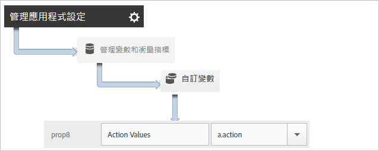
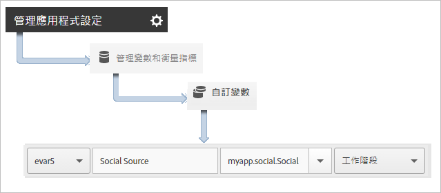

# 追蹤應用程式動作 {#track-app-actions}

動作為發生在您要測量之應用程式中的事件。每個動作有一或多個對應量度，會隨著每次事件發生而增量。例如，您可以在每次檢視文章或每次完成某個層級時，追蹤新訂閱。這些事件的對應量度會設定為訂閱、已閱讀文章及已完成層級。

不會自動追蹤動作，因此，若要追蹤事件，您必須呼叫 `trackAction`。

## Tracking actions {#section_380DF56C4EE4432A823940E4AE4C9E91}

1. 新增資料庫至您的專案與實施生命週期。

   如需詳細資訊，請 *參閱核心實作和生命週期中的「將SDK和設定檔案新*[增至專案」](/help/ios/getting-started/dev-qs.md)。
1. 匯入程式庫.

   ```objective-c
   #import "ADBMobile.h"
   ```

1. 當您要追蹤的動作在應用程式中發生時，請針對此動作呼叫 `trackAction` 以傳送點擊.

   ```objective-c
   [ADBMobile trackAction:@"myapp.ActionName"  
                     data:nil];
   ```

   >[!TIP]
   >
   >If the code where you are adding this call might run while the app is in the background, call `trackActionFromBackground` instead of `trackAction`.

1. In the Adobe Mobile services UI, select your app and click **[!UICONTROL Manage App Settings]**.

1. 按一下&#x200B;**[!UICONTROL 「管理變數和衡量指標」]**，然後按一下&#x200B;**「自訂量度」]標籤。[!UICONTROL **

1. 將程式碼中定義的內容資料名稱 (例如，`a.action=myapp.ActionName`) 對應至某個自訂事件。

   

You can also set a prop to hold all action values by mapping a custom prop with a name like **[!UICONTROL Custom Actions]** and setting the value to `a.action`.



## Sending additional data {#section_3EBE813E54A24F6FB669B2478B5661F9}

除了動作名稱之外，您還可以隨著每次追蹤動作呼叫傳送其他內容資料:

```objective-c
NSMutableDictionary *contextData = [NSMutableDictionary dictionary]; 
[contextData setObject:@"Twitter" forKey:@"myapp.social.SocialSource"]; 
[ADBMobile trackAction:@"myapp.SocialShare" data:contextData];
```

Context data values must be mapped to custom variables:



## Tracking background actions {#section_AC13013F207D4FBAAF27E4412034251E}

如果您在程式碼中追蹤的動作會在應用程式於背景時執行，請改為呼叫 `trackActionFromBackground` 而非 `trackAction`。雖然 `trackActionFromBackground` 包含可防止生命週期呼叫在不應觸發時發生的部分其他邏輯，但其所使用的參數仍相同。

## Action reporting {#section_0F6A54AB7A3F42C9BB042D86A0FC4630}

| 介面 | 報告 |
|--- |--- |
| Adobe Mobile Services | ****&#x200B;動作路徑報表. 檢視動作於應用程式中發生的順序。您也可以按一下任一報表上的&#x200B;**[!UICONTROL 「自訂」]，以檢視動作的排名、趨勢或在劃分報表中的情況，或套用篩選條件以檢視特定區段的動作。** |
| 行銷報告與分析 | **[!UICONTROL 「自訂事件」]**&#x200B;報表。當動作對應至自訂事件後，您可以檢視與所有其他 Analytics 事件類似的行動事件。 |
| Ad hoc analytics | **[!UICONTROL 「自訂事件」]**&#x200B;報表。當動作對應至自訂事件後，您可以檢視與所有其他 Analytics 事件類似的行動事件。 |