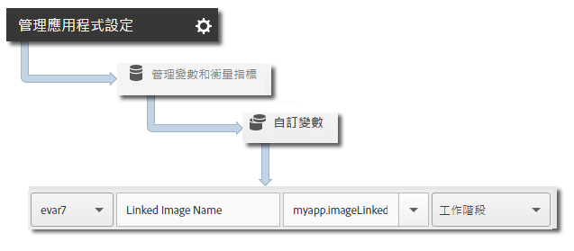

# 訪客期限值 {#visitor-lifetime-value}

期限值可讓您測量每個使用者的期限值並將其設為目標。

每次您以 `trackLifetimeValueIncrease` 傳送一個值時，就會將該值新增至現有值。期限值儲存在裝置上，且可透過呼叫 `lifetimeValue` 隨時擷取。此值可用來儲存期限購買數、廣告檢視次數、視訊完成次數、社交分享和照片上傳數等等。

## 追蹤訪客期限值 {#section_390943A49AF841F2941E65D6DF2B3F5A}

1. 新增資料庫至您的專案與實作生命週期。

   如需詳細資訊，請參閱[核心實作與生命週期](/help/ios/getting-started/dev-qs.md)中的&#x200B;*新增 SDK 和設定檔至您的專案*。
1. 匯入資料庫:

   ```objective-c
   import com.adobe.mobile.*;
   ```

1. 以要增加值的量呼叫 `trackLifetimeValueIncrease`：

   ```objective-c
   [ADBMobile trackLifetimeValueIncrease:increaseAmount data:nil];
   ```

## 傳送其他資料 {#section_3EBE813E54A24F6FB669B2478B5661F9}

除了期限值之外，您還可以傳送隨著每次追蹤動作呼叫傳送其他內容資料:

```objective-c
NSMutableDictionary *contextData = [NSMutableDictionary dictionary]; 
[contextData setObject:imageName forKey:@"myapp.ImageLiked"]; 
[ADBMobile trackLifetimeValueIncrease:increaseAmount data:contextData];
```

內容資料值必須對應至自訂變數:


