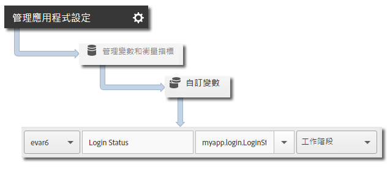

# 追蹤應用程式狀態 {#track-app-states}

狀態是您的應用程式中不同的畫面或檢視。每次在您的應用程式中顯示新狀態時 (例如，當使用者從首頁導覽至新聞摘要時)，都會傳送追蹤狀態呼叫。在 iOS 中，通常會以每個檢視的 viewDidLoad 方法追蹤狀態。

>[!TIP]
>
>若要追蹤狀態，請呼叫 `trackState`。系統不會自動追蹤狀態。

## 追蹤狀態 {#section_380DF56C4EE4432A823940E4AE4C9E91}

1. 新增資料庫至您的專案與實作生命週期。

   如需詳細資訊，請參閱[核心實施與生命週期](/help/ios/getting-started/dev-qs.md)中的&#x200B;*新增 SDK 和設定檔案至您的專案*。
1. 匯入資料庫。

   ```objective-c
   #import "ADBMobile.h"
   ```

1. 呼叫 `trackState` 以傳送該狀態檢視的點擊。

   ```objective-c
   [ADBMobile trackState:@"Login Screen"  
                    data:nil];
   ```

在 Adobe Mobile Services 中，**[!UICONTROL 狀態名稱]**&#x200B;會在 *`View State`* 變數中回報，並且每次 `trackState` 呼叫的檢視都會記錄下來。在其他 Analytics 介面中，**[!UICONTROL View State]** 會回報為 **[!UICONTROL Page Name]**，而 state views 會回報為 page views。

## 傳送其他資料 {#section_CFDB4F944496401786A145C209AB387C}

除了&#x200B;**[!UICONTROL 狀態名稱]**&#x200B;之外，您還可以隨著每次追蹤動作呼叫傳送其他內容資料:

```objective-c
NSMutableDictionary *contextData = [NSMutableDictionary dictionary]; 
[contextData setObject:@"logged in" forKey:@"myapp.login.LoginStatus"]; 
[ADBMobile trackState:@"Home Screen" data:contextData];
```

內容資料值必須對應至自訂變數:



## 應用程式狀態報表 {#section_0F6A54AB7A3F42C9BB042D86A0FC4630}

狀態通常是透過路徑報表來檢視，所以您可以瞭解使用者如何導覽應用程式以及最常檢視哪些狀態。

|  |  |
|--- |--- |
| Adobe Mobile Services | **[!UICONTROL 「檢視狀態」]**&#x200B;報表。此報表是根據使用者透過您的應用程式所採取的路徑而成。範例路徑為&#x200B;**[!UICONTROL 「首頁]** > **[!UICONTROL 設定]** > **[!UICONTROL 摘要」]**。 |
| Adobe Analytics | 能夠檢視「頁面」之處皆可檢視狀態，例如:**[!UICONTROL 「頁面」]**&#x200B;報表、**[!UICONTROL 「頁面檢視」]**&#x200B;報表以及&#x200B;**[!UICONTROL 「路徑」報表。]** |
| Ad hoc analytics | 透過&#x200B;**[!UICONTROL 「頁面」]**&#x200B;維度、**[!UICONTROL 「頁面檢視」]**&#x200B;量度及&#x200B;**[!UICONTROL 「路徑」報表，就能在可以檢視「頁面」的任何地方來檢視狀態。]** |
