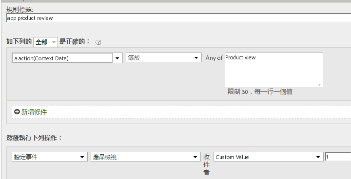

# 移轉至4.x SDK{#migrate-to-x}

本節說明如何從3.x版Windows行動SDK移轉至適用於Experience Cloud解決方案的通用Windows平台4.x SDK。

移至4.x版後，所有功能現在都可透過靜態方法存取。 您不再需要追蹤自己的物件。

以下各節將逐步引導您從3.x版移轉至4.x版。

## 移除未使用的屬性 {#section_145222EAA20F4CC2977DD883FDDBBFC5}

您可能注意到下載中包含新的`ADBMobileConfig.json`檔案。 此檔案包含應用程式專用的全域設定，並取代舊版中使用的大部分設定變數。

以下是 `ADBMobileConfig.json` 檔案的範例:

```js
{ 
    "version" : "1.0", 
    "analytics" : { 
        "rsids" : "coolApp", 
        "server" : "my.CoolApp.com", 
        "charset" : "UTF-8", 
        "ssl" : true, 
        "offlineEnabled" : true, 
        "lifecycleTimeout" : 300, 
        "privacyDefault" : "optedin", 
        "poi" : [ 
                    ["san francisco",37.757144,-122.44812,7000], 
                    ["santa cruz",36.972935,-122.01725,600] 
                ] 
    }, 
 "target" : { 
  "clientCode" : "myTargetClientCode", 
  "timeout" : 5 
 }, 
 "audienceManager" : { 
  "server" : "myServer.demdex.com" 
 } 
}
```

以下表格列出您需要移至設定檔案的設定變數。將第一欄中變數的值集移至第二欄中的變數，然後從程式碼中移除舊組態變數。

### 從3.x移轉

下表提供3.x SDK中的變數清單，以及4.x SDK中的新名稱：

| 組態變數／方法 | 變數。`ADBMobileConfig.json` |
|--- |--- |
| offlineTrackingEnabled | &quot;offlineEnabled&quot; |
| reportSuiteIDs | &quot;rsids&quot; |
| trackingServer | &quot;server&quot; |
| charSet | &quot;charset&quot; |
| currencyCode | &quot;currency&quot; |
| ssl | &quot;ssl&quot; |
| setOfflineHitLimit | 移除，不再使用。 |
| linkTrackVars | 移除，不再使用。 |
| linkTrackEvents | 移除，不再使用。 |

## 更新追蹤呼叫和追蹤變數 {#section_96E7D9B3CDAC444789503B7E7F139AB9}

版本4 SDK不使用以網頁為主的`Track`和`TrackLink`呼叫，而是使用兩種在行動世界中更有意義的方法：

* `TrackState` 狀態是應用程式中可用的檢視，例如「首頁儀表板」、「應用程式設定」、「購物車」等。這些狀態類似於網站上的頁面，且 `trackState` 呼叫會遞增頁面檢視。

* `TrackAction` 動作是您要測量的應用程式中發生的事，例如「登入」、「橫幅點選」、「動態消息訂閱」和其他量度。這些呼叫不會增加頁面檢視。

這兩種方法的`contextData`參數都包含作為上下文資料傳送的名稱值對。

### 事件、Prop、eVar

如果您已檢視過[SDK方法](/help/universal-windows/c-configuration/methods.md)，您可能會想知道要在何處設定事件、eVar、prop、繼承和清單。 在第4版中，您無法再直接在應用程式中指派這些類型的變數。 SDK 會改為使用內容資料和處理規則，將應用程式資料對應至 Analytics 變數以便報告。

處理規則具備以下優點：

* 您可以直接變更資料對應，而無須將更新提交至 App Store。
* 您可以用有意義的資料名稱，取代設定報表套裝專用的變數。
* 對傳送額外資料的影響極小。這些值在使用處理規則對應之前，不會出現在報表中。

如需詳細資訊，請參閱[Analytics綜覽](/help/universal-windows/analytics/analytics.md)中的&#x200B;*處理規則*&#x200B;一節。

您直接指派給變數的任何值，應改為新增至上下文資料。 這表示對`SetProp`、`SetEvar`的呼叫和對永久性上下文資料的指派應全部移除，並將值新增至上下文資料。

### AppSection/伺服器、GeoZip、交易 ID、促銷活動以及其他標準變數

您在測量物件上設定的任何其他資料（包括上述的變數），應改為新增至上下文資料。 也就是說，隨`TrackState`或`TrackAction`呼叫傳送的唯一資料是`data`參數中的裝載。

**取代追蹤呼叫**

在程式碼中，請以呼叫`trackState`或`trackAction`取代下列方法：

**從3.x移轉：**

* TrackAppState(TrackState)
* TrackEvents(TrackAction)
* Track(TrackAction)
* TrackLinkURL(TrackAction)

## 自訂ID服務{#section_2CF930C13BA64F04959846E578B608F3}

以呼叫 `visitorID`: 取代`setUserIdentifier` 變數。

## 離線追蹤 {#section_5D4CD8CD1BE041A79A8657E31C0D24C6}

在`ADBMobileConfig.json`檔案中啟用離線追蹤。所有其他離線設定都會自動完成。

在整個程式碼中，移除對下列方法的呼叫：

**從3.x移轉：**

* SetOnline
* SetOffline

## 產品變數 {#section_AFBA36F3718C44D29AF81B9E1056A1B4}

由於處理規則中沒有該產品變數，因此您可以使用以下語法來設定 `products`:

```js
// create a processing rule to set the corresponding product event. 
// for example, set the Product Views event when context data a.action = "product view" 
var cdata = new Windows.Foundation.Collections.PropertySet(); 
cdata["&&products"] = ";Cool Shoe"; 
ADB.Analytics.trackAction("product view", cdata);
```



`"&&products"`的值（在此範例中，值為`";Cool Shoe`&quot;）應遵循您所追蹤之事件類型的產品字串語法。
