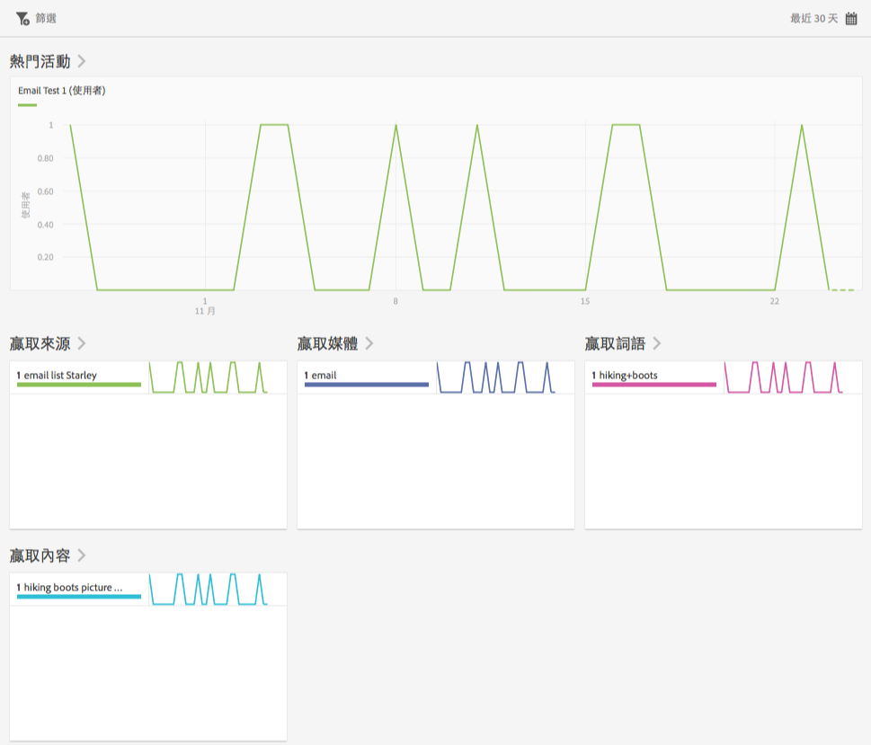
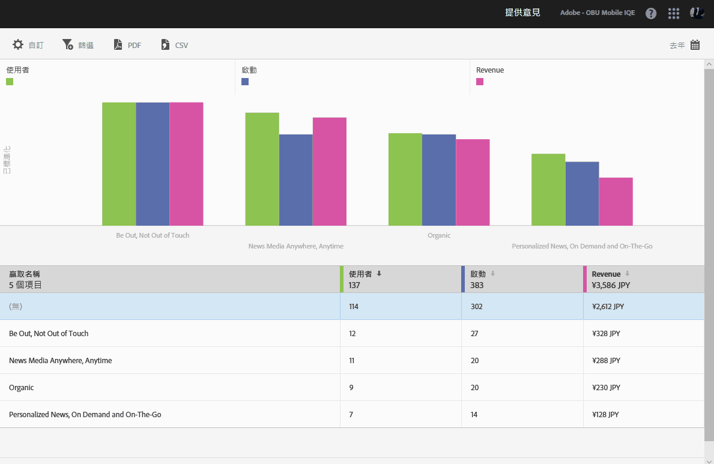

# 贏取 {#acquisition}

{#eol}

行銷人員可建立追蹤連結來進行促銷，並促進對其應用程式的流量。這些追蹤連結可以將使用者引導至應用程式商店、應用程式深層連結和插入式深層連結，以便將其關聯至應用程式內行為。行銷人員可視需要建立一個連結，將使用者路由至 iOS、Android 或其他平台。

## 新版 Adobe Experience Cloud SDK

在尋找 Adobe Experience Platform Mobile SDK 的相關資訊和文件嗎？按一下[這裡](https://aep-sdks.gitbook.io/docs/)以取得最新文件。

我們於 2018 年 9 月發行了全新的 SDK 主要版本。這些新的 Adobe Experience Platform Mobile SDK 可透過 [Experience Platform Launch](https://www.adobe.com/tw/experience-platform/launch.html) 設定。

* 若要開始使用，請前往 [Launch](https://launch.adobe.com/)。
* 若要查看 Experience Platform SDK 的儲存庫內容，請前往 [Github: Adobe Experience Platform SDK](https://github.com/Adobe-Marketing-Cloud/acp-sdks)。

>[!IMPORTANT]
>
> 如果您使用 Adobe Experience Platform Mobile SDK 搭配 Adobe Launch，您&#x200B;**必須**&#x200B;同時安裝 Adobe Analytics Mobile Services 擴充功能，方可使用贏取連結之類的 Adobe Mobile Services 功能。如需詳細資訊，請參閱 [Adobe Analytics - Mobile Services](https://aep-sdks.gitbook.io/docs/using-mobile-extensions/adobe-analytics-mobile-services)。如需如何將贏取及行銷連結與 Experience Cloud SDK 搭配使用的詳細資訊，請參閱[贏取與行銷連結](https://aep-sdks.gitbook.io/docs/using-mobile-extensions/adobe-analytics-mobile-services#acquisition-and-marketing-links)。

>[!IMPORTANT]
>
>雖然您可在使用者介面中設定功能，但您還必須下載產生的設定檔案，並將該檔案新增到 SDK 中，這些功能才會發揮作用。如需下載和設定 SDK 的詳細資訊，請參閱本頁的 *SDK 文件*&#x200B;區段。

您可以在可追蹤的行動應用程式行銷連結上建立、編輯、管理和檢視報表。

>[!TIP]
>
>此功能需要 Adobe Analytics - Mobile Apps 或 Adobe Analytics Premium SKU。

下列「贏取」報表提供行銷連結表現情形的深入分析:

* **概述** {#section_5B2BA47F22694919A472AB591101237E}

   此報表顯示了引導使用者至您的應用程式的行銷活動排名，並提供行銷活動在其他追蹤中繼資料 (例如贏取來源、媒體、行銷期和內容) 績效的資訊。

   

* **連結報表** {#section_A23A640C363B43569D9D484CF49EA277}

   此報表針對您的行銷連結績效提供排名視圖。除了檢視含有關鍵績效指標的連結名稱之外，您也可以自訂此報表的內容。如需詳細資訊，請參閱[自訂報表](/help/using/usage/reports-customize/t-reports-customize.md)。

   請記住以下資訊:

   * 您可以按一下欄標題中的箭頭圖示，以遞增或遞減順序排序資料。
   * 若要將資料匯出為 PDF 文件，您可以按一下&#x200B;**[!UICONTROL 下載]**。
   
