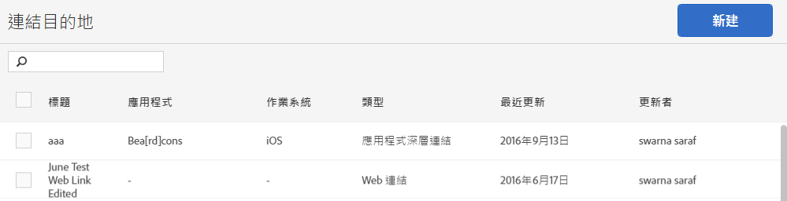

# 建立及管理連結目的地{#create-and-manage-link-destinations}

您可以在管理連結目的地頁面建立、編輯、封存/取消封存及刪除連結目的地。建立行銷連結、推播通知或應用程式內訊息時，可以內嵌這些目的地。

若要顯示管理連結目的地頁面:

1. From the left navigation menu, click **[!UICONTROL Manage Apps]**.
1. 按一下應用程式的名稱以顯示其應用程式資訊頁面。
1. In the top right side, click **[!UICONTROL Manage Link Destinations]**.

「連結目的地」頁面顯示您的連結目的地，並提供建立、封存、取消封存、編輯和刪除連結目的地的選項。

例如:

