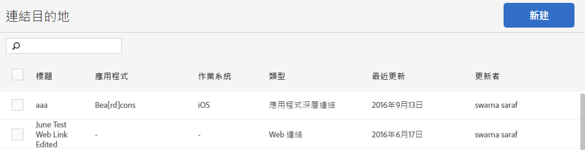

# Manage link destinations{#manage-link-destinations}

您可以使用「連結目的地」頁面以編輯、封存、取消封存或刪除現有的目的地。

若要顯示管理連結目的地頁面:

1. In the Mobile Services UI, click **[!UICONTROL Manage Apps]**.
1. 在應用程式的「應用程式資訊」頁面上，按一下「管 **[!UICONTROL 理連結目的地」]**。

   

1. (條件式) 請執行適當的工作:

   * **編輯**

      若要編輯現有的連結目的地，請在清單中按一下其名稱，然後編輯相關欄位。如需詳細資訊，請參閱 建 [立新的連結目的地](/help/using/acquisition-main/c-manage-link-destinations/t-create-new-app-deep-link-destination.md)。

      >[!IMPORTANT]
      >
      >It might take up to 15 minutes for these changes to take effect.

   * **封存**

      You can archive link destinations that you want to retain, but you want to remove from the **[!UICONTROL Link Destinations]** list.

      To archive link destinations, select one or more check boxes next to the link names and click **[!UICONTROL Archive Selected]**. Because your link destination is archived, and can be unarchived at any time, you do not need to confirm your action.

   * **取消封存**

      如果您想要讓先前封存的連結目的地再次顯示在「連結目的地」清單中，可以取消封存先前封存的連結目的地。

      要取消存檔連結目標：

      1. click **[!UICONTROL View Archive]**.
      1. 選取您要取消封存之連結名稱旁的一或多個核取方塊。
      1. 按一下「 **[!UICONTROL 取消封存選取的項目]**」。
      **[!UICONTROL 「檢視封存」]選項只有在您先前曾封存過連結目的地的情況下才會顯示。**

   * **刪除**

      To delete a link destination, select one or more check boxes next to the links you want to delete, click **[!UICONTROL Delete Selected]**, and click **[!UICONTROL Delete]** to confirm your action.

      >[!IMPORTANT]
      >
      >刪除連結目的地是永 **久的**。 如果您不確定是否要刪除連結目的地，建議使用封存選項。

