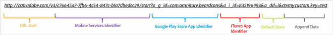
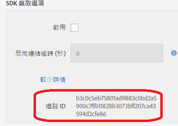

# 手動建立贏取連結 {#create-acquisition-link-manually}

您可以透過手動設定 URL 參數來建立行銷連結，即時贏取新的行動應用程式使用者。

>[!IMPORTANT]
>
>此功能需使用 SDK 4.6 版或更新版本。如需詳細資訊，請參閱[贏取必要條件](/help/using/acquisition-main/c-acquisition-prerequisites.md)。

下圖說明手動建立追蹤連結的元件，並顯示當您手動建立贏取連結時需正確設定的不同 URL 參數。

系統會設定此連結來為行動應用程式執行 Google Play 商店或 Apple App Store 平台專屬重新導向。如果無法判別目的地，預設商店設定為 Apple App Store。安裝應用程式後，自訂內容索引鍵 `my.custom.key:test` 會附加至 Analytics 安裝點擊。

若要手動建立連結，請使用下列 URL 格式:

`http(s)://c00.adobe.com/v3/ {mobile-services-app-hash}/start? {parameters}`

>[!TIP]
>
>使用的 Android SDK 版本對此程序沒有影響。

若是 iOS，請確認您使用正確的通訊協定:

* 如果您是使用 4.7.0 版以前的 iOS SDK，或使用 iOS SDK 4.7.0 或更新版本，且在管理應用程式設定頁面上&#x200B;**未**&#x200B;選取&#x200B;**[!UICONTROL 使用 HTTPS]**，請使用 **HTTP**。
* 如果您是使用 iOS SDK 4.7.0 或更新版本，且在管理應用程式設定頁面上已&#x200B;**選取**&#x200B;使用 HTTPS ****，請使用 **HTTPS**。

在符合下列條件的情況下:

* `{mobile-services-app-hash}` 符合設定檔案 `acquisition:appid ` 中的應用程式識別碼。

   您可以在「追蹤 ID」欄位中「赢取 SDK 選項」下「的管理應用程式設定」頁面中找到 `{mobile-services-app-hash}`。

   

* `{parameters}` 是特別命名的標準 URL 查詢參數清單.

以下為參數清單:

* **`a_g_id`**

   Google Play 商店應用程式識別碼.

   * 範例值: `com.adobe.beardcons`

* **`a_g_lo`**

   Google Play 商店地區設定覆寫.

   * 範例值: `ko`

* **`a_i_id`**

   iTunes 應用程式識別碼.

   * 範例值: `835196493`

* **`a_i_lo`**

   iTunes 地區設定覆寫.

   * 範例值: `jp`

* **`a_dd`**

   自動重新導向的預設商店.

   * 範例值: `i | g`

* **`a_cid`**

   自訂 ID 覆寫 (通常 iOS 是 IDFA，Android 是 ADID).

   * 範例值: `Any String < 255 characters (UTF-8 encoded)`

* **`ctx*`**

   前置詞為 `ctx` 的索引鍵會在所產生啟動點擊的內容資料中。

   * 範例值: `ctxmy.custom.key=myValue`

* **`ctxa.referrer.campaign.name`**

   使用者募集活動名稱.

   如果您想比較不同贏取連結的績效，此參數為必需的報表項目。

   * 範例值: 2015 年高峰會

* **`ctxa.referrer.campaign.trackingcode`**

   追蹤程式碼

   如果您想比較不同贏取連結的績效，此參數為必需的報表項目。

   * 範例值: `lexsxouj`

* **`ctxa.referrer.campaign.source`**

   來源。

   * 範例值: 廣告網路

* **`ctxa.referrer.campaign.medium`**

   媒體

   * 範例值: 電子郵件

* **`ctxa.referrer.campaign.content`**

   內容

   * 範例值: 影像 #325689

* **`ctxa.referrer.campaign.term`**

   詞語

   * 範例值: 健行和靴子

手動建立贏取連結時，請記住下列資訊:

* 不符合上表參數的所有參數，都會視為應用程式商店重新導向的一部分而傳遞。
* 所有參數基本上都是選用的，如果指定至少一個商店 ID，連結將無法使用。

   `a_i_id`/ `a_g_id` 是商店 ID 的範例。

* 如果無法自動判別目的地商店，且沒有提供預設商店，系統便會傳回 404 錯誤。
