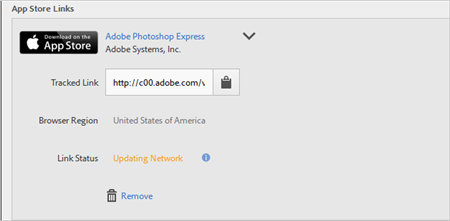

# 建立贏取連結{#create-an-acquisition-link}

您可以建立應用程式商店連結後，以便直接從 Apple App Store 和 Google Play 下載應用程式。您所建立的連結可讓您將成功事件歸因於下載。

1. 按一下&#x200B;**[!UICONTROL 「贏取]** > **[!UICONTROL 管理贏取連結]** > **[!UICONTROL 新建」]**。
1. 在&#x200B;**[!UICONTROL 連結資訊]**&#x200B;區段中輸入下列資訊:

   * (**必填**) 為應用程式連結指定描述性&#x200B;**[!UICONTROL 名稱]**。
   * **[!UICONTROL 追蹤代碼]**
指定想要的追蹤代碼，或按一下**[!UICONTROL 產生]**&#x200B;建立新的追蹤代碼。
   * (**必填**) **[!UICONTROL 來源]**
指定原始反向連結，例如「電子報」或「首頁」。
   * **[!UICONTROL 媒體]**
指定行銷媒體，例如「橫幅」或「電子郵件」。
   * **[!UICONTROL 內容]**
指定連結相關廣告的名稱或 ID。
   * **[!UICONTROL 詞語]**
指定廣告的付費詞語或其他搜尋詞。
   >[!IMPORTANT]
   >
   >建立贏取連結後，就無法變更以上欄位中的值。

1. 在&#x200B;**[!UICONTROL 新增應用程式商店連結]**&#x200B;區段的欄位中輸入資訊。

   * **[!UICONTROL App Store]**

      選取應用程式商店:
      * Apple App Store
      * Google Play

      每個應用程式商店的選項會有所不同，如下所述。

   * **[!UICONTROL 瀏覽器地區 (僅限 Apple App Store)]**

      指定桌面瀏覽器的特定地區性應用程式商店。

      此設定可讓您定義特定區域的應用程式商店，讓使用者在桌面瀏覽器上按一下贏取連結後，即導向該商店。行動裝置會依據裝置設定而自動重新導向。

   * **[!UICONTROL 瀏覽器語言 (Google 語言，僅適用於 Google Play)]**

      從下拉式清單中選取語言。

      此設定可讓您為桌面瀏覽器定義顯示在 Google Play Store 中的特定語言。行動裝置會依據裝置設定而顯示語言。

   * **[!UICONTROL 依名稱搜尋]**

      * 若使用 Apple App Store，如果您不知道應用程式 ID，可以依名稱搜尋應用程式。

         您可從「**[!UICONTROL 地區]**」下拉式清單中選取可選地區，限制搜尋範圍。

      * 若使用 Google Play，如果您不知道封裝名稱，可以依名稱搜尋應用程式名稱。
   * **[!UICONTROL 應用程式 ID (僅限 Apple App Store)]**

      如果您搜尋應用程式，此欄位會自動完成。您可以直接輸入「應用程式 ID」值，省去搜尋應用程式的程序。

   * **[!UICONTROL 封裝名稱 (僅限 Google Play)]**

      如果您搜尋應用程式，此欄位會自動完成。無需進行搜尋，您也可以直接輸入封裝名稱值。

1. 若要儲存設定並產生連結，請依序按一下&#x200B;**[!UICONTROL 「新增]** > **[!UICONTROL 儲存」]**。

   新建立的連結會顯示在「**[!UICONTROL App Store 連結]**」區段中。

   

1. 按一下可將追蹤連結複製到您的剪貼簿。

1. 將連結貼到您的社交媒體貼文、廣告、電子郵件訊息等項目中。
