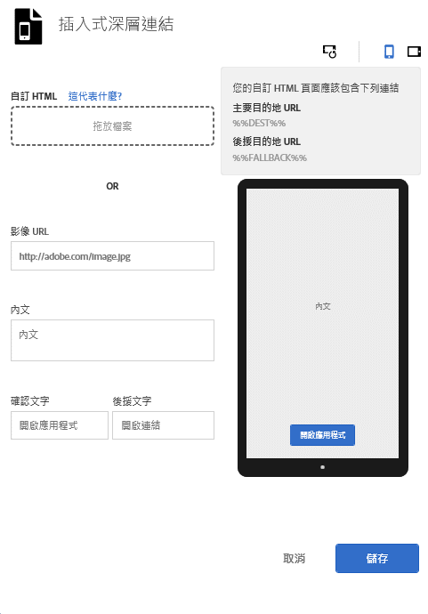

# 插頁廣告{#interstitials}

依使用者是否已安裝應用程式 (應用程式深層連結) 或未安裝 (前往網站或應用程式商店) 將使用者路由至目的地。最好由使用者自行選擇路由。行銷人員可以設定插入式連結頁面，對使用者顯示可用的登陸目的地，以為其提供選擇。

若要在建立行銷連結時設定插入式連結：

1. 按一下&#x200B;**[!UICONTROL 編輯插入式深層連結]**。

   

1. 在下列欄位輸入資訊:

   * **[!UICONTROL 自訂 HTML]**

      選取自訂的插入式 HTML 頁面。

      透過使用自訂插入式連結，行銷人員可以使用自訂 HTML/CSS/JS 來自訂插入式登陸頁面，讓您為頁面加上品牌視覺材料。

      以下是 HTML 頁面的需求：

      * 必須是 HTML 檔案。
      * 必須包含 `%%DEST%%` 和 `%%FALLBACK%%` 預留位置。
      * 上傳的 HTML 會在 `<iframe>` 中呈現。

         您必須確保連結目標會指向父視窗。您可以在 `<head>` 中加入 `<base target="_parent" />`，或是為每個 `<a/>` 分別指定目標屬性。

         >[!TIP]
         >
         >如果您上傳自訂 HTML，此表格中的其他四個選項就無法使用 (除非您將上傳的檔案移除)。
   * **[!UICONTROL 影像 URL]**

      指定 URL 為影像資產。

   * **[!UICONTROL 內文]**

      指定插入式連結的內文。

   * **[!UICONTROL 確認文字]**

      指定文字按鈕的文字。

   * **[!UICONTROL 後援文字]**

      指定要顯示的後援文字。

      如果深層連結失敗，此欄位將會更新文字按鈕。在允許使用者後援至其他選項之前，會將使用者導向至嘗試深層連結。例如，後援可能會導向至應用程式商店以下載並安裝應用程式，或是將使用者帶往公司網站。後援文字可讓使用者得知在深層連結失敗時有其他選項可供使用。

1. (**選擇性**) 按一下影像上方的圖示，查看插入式連結旋轉及在不同裝置上的外觀。

   您可以在 Mobile Services 外部變更或編輯影像，確保影像在不同的狀況中可正確顯示。
1. 按一下&#x200B;**[!UICONTROL 「儲存」]**。
