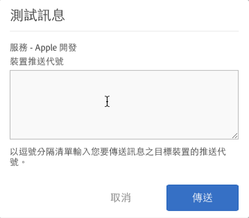

# 啟用推送訊息的必要條件 {#prerequisites-to-enable-push-messaging}

您必須先完成這些工作才 可開始在應用程式中 設定推送訊息。

## 為貴公司啟用 Experience Cloud

貴公司已採用 Adobe Analytics，必須啟用 Experience Cloud。您可向您的 Adobe 業務經理確認狀態。

## 安裝和設定行動 SDK

* **安裝行動 SDK**

   若要設定推送訊息，您必須下載並安裝 4.6 版或更新版的行動 SDK。如需詳細資訊，請參閱[下載 SDK](/help/using/c-manage-app-settings/c-mob-confg-app/t-config-analytics/download-sdk.md)。

* **設定推送服務**

   您必須在行動 SDK 中設定推送服務。如需詳細資訊，請參閱下列內容：

   * [Android 中的推播訊息](/help/android/messaging-main/push-messaging/push-messaging.md)
   * [iOS 中的推播訊息](/help/ios/messaging-main/push-messaging/push-messaging.md)

## 使用 Adobe ID 登入 Mobile 核心服務

>[!IMPORTANT]
>
>若要使用推送服務功能，使用者必須使用其 Adobe ID 登入 Mobile 核心服務，且其 Analytics 帳戶必須連結至他們的 Adobe ID。如果使用者以其現有 Adobe Analytics 帳戶登入，就無法使用推送服務功能。

如果使用者沒有 Adobe ID，請完成下列步驟：

1. (**Experience Cloud 系統管理員**) 邀請使用者前往 Experience Cloud。

1. (**使用者**) 按照 Experience Cloud 系統管理員提供的指示，建立個人 Adobe ID。

   系統管理員完成前一步驟後，系統會自動傳送電子郵件訊息給每位使用者。

1. (**使用者**) 使用其 Adobe ID 登入 Mobile。

## 在 Experience Cloud 中連結使用者的帳戶

每位使用者必須從 Experience Cloud 組織連結 Analytics 解決方案帳戶。

1. 登錄到 [Adobe Experience Cloud](https://experience.adobe.com) 和Adobe ID。

1. 在右上角選取 Analytics 公司名稱。

1. 按一下&#x200B;**[!UICONTROL 「新增組織」]**，接著從下拉式清單中選取&#x200B;**[!UICONTROL 「Adobe SiteCatalyst/Adobe Social」。]**

1. 輸入公司名稱以及所指定之公司的舊憑證，然後按一下&#x200B;**[!UICONTROL 「連結帳戶」]**。

   Adobe ID 現在已連結至您的 Analytics 帳戶、公司以及登入憑證。

有關詳細資訊，請參見 [Experience Cloud中的組織](https://experienceleague.adobe.com/docs/core-services/interface/administration/organizations.html?lang=zh-Hant) 中的「Experience Cloud中心介面元件」。

## 在 Mobile 使用者介面中設定推送服務和 SDK ID 服務

在您啟用應用程式的 ID 服務前，**[!UICONTROL 「推送服務」]**&#x200B;區段為停用狀態。但是一旦您啟用 ID 服務，「推送服務」區段即會啟用。如需啟用推送服務的詳細資訊，請參閱[設定 SDK ID 服務選項](/help/using/c-manage-app-settings/c-mob-confg-app/t-config-visitor.md)。

>[!IMPORTANT]
>
>您必須按一下&#x200B;**[!UICONTROL 「儲存」]**，才可以儲存變更並重新整理「推送服務」。
>
>您可以在每個報表套裝中，為 Apple 設定一個應用程式商店應用程式，同時也為 Google 設定一個。如果您還需要其他應用程式，例如一個用於生產環境，另一個用於開發環境，那麼，請為每個環境設定新的應用程式商店應用程式和新的報表套裝。

* **Apple**：請拖放您的私密金鑰和/或憑證。如果您的私密金鑰以密碼加密，請輸入密碼。

   * 如果設定的是&#x200B;**私密金鑰**，請將私密金鑰檔案拖放至方塊中。

      您也可以按一下&#x200B;**[!UICONTROL 「瀏覽」]**&#x200B;來選取檔案。此檔案包含私密金鑰。此檔案中可能也包含憑證 (`.p12`、`pkcs12`、`.pfx`、`.key`、`.pem`)。

   * 若為&#x200B;**「私密金鑰密碼」**，如果您的私密金鑰檔案有加密，請輸入密碼。

      (有條件) 若為&#x200B;**「憑證」**，請將憑證檔案拖放至方塊中。您也可以按一下&#x200B;**[!UICONTROL 「瀏覽」]**&#x200B;來選取檔案。如果私密金鑰檔案中同時包含憑證 (`.cert`、`.cer`、`.crt`、`.pem`)，則此欄位非必填欄位。

* **Google**：請指定應用程式的 API 密鑰。

   按一下&#x200B;**[!UICONTROL 「測試」]**，驗證應用程式和 Mobile Services 是否已正確設定。此選項對偵錯和疑難排解很實用。

   輸入您要傳送訊息之裝置的推送代號。以逗號分隔清單指定代號，即可傳送訊息給多部裝置。

   
