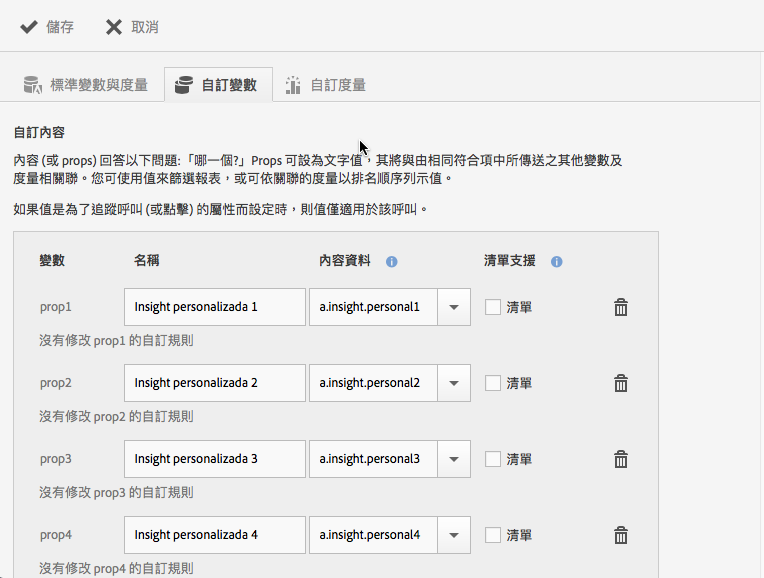
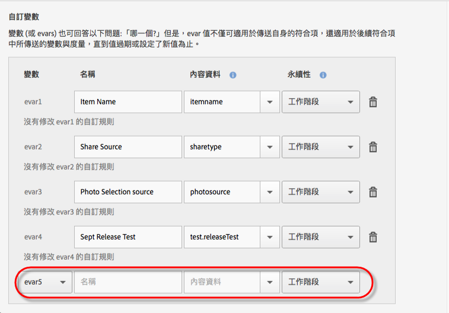

# 管理您的應用程式 {#managing-your-app}

您可以透過設定各種變數和量度以追蹤及管理從應用程式接收的資料。

## 管理變數和量度 {#section_EC2D58AC334F4ED49E764B81C2423A62}

* **「標準變數與量度」**

   每個應用程式都包含變數和量度，可追蹤購物車和購物活動。Some purchase information cannot be handled with processing rules, so the SDK exposes the special `"&&products"` context data. 舉例來說，您會有購物車新增、購物車移除、結帳、訂購等變數，上下文資料須映射 Adobe Analytics 中的資料。如果以簡單的內容資料映射填入此變數，則這是映射至它的關鍵值。如果變數由Analytics管理工具中較複雜的規則填入，請將其留空。

   如需這些變數和量度的詳細資訊，請參閱下列內容:

   * [Android中的產品變數](/help/android/analytics-main/products/products.md)
   * [iOS中的產品變數](/help/ios/analytics-main/products/products.md)

* **自訂變數**

   「自訂變數」頁面會顯示為報表套裝 (此套裝包含您的應用程式資料) 設定的所有自訂 Analytics 變數。您可以在此頁面上啟用其他變數，並將內容資料映射至 Analytics 變數。

### 映射上下文資料至 Analytics 變數

Click **[!UICONTROL Manage App Settings]** &gt; **[!UICONTROL Manage Variables &amp; Metrics]** &gt; **[!UICONTROL Custom Variables]**.

These mappings call the same API that is used in [Processing Rules](https://docs.adobe.com/content/help/en/analytics/admin/admin-tools/processing-rules/processing-rules.html).

以下是您可以設定的自訂變數清單:

* The **[!UICONTROL Custom Properties]** (or props) answer the question "which one?" Props 可設為文字值，該值將與在相同點擊中傳送的其他變數及量度相關聯。此值可用來篩選報表，或可依關聯的量度以排名順序列出。

   如果值是為了追蹤呼叫 (或點擊) 的內容而設定時，則值僅適用於該呼叫。

* The **[!UICONTROL Custom Variables]** (or evars) also answer the question "which one?" 但是，evar 值不僅可適用於傳送自身的點擊，還適用於後續點擊中所傳送的變數與量度，直到值過期或設定了新值為止。
* The **[!UICONTROL Custom List Variables (or Multi-Value Variables)]** behave the same as variables except they allow you to capture multiple values on one hit. 如需詳細資訊，請參 [閱清單變數](https://docs.adobe.com/content/help/en/analytics/implementation/javascript-implementation/variables-analytics-reporting/page-variables.html)。

Analytics中會顯示下列對應，如Mobile services中所建立。

* **[!UICONTROL 名稱]**

   資料收集變數的好記名稱。

* **[!UICONTROL 內容資料]**

   如果以簡單的內容資料映射填入此變數，則這是映射至它的關鍵值。如果要依 Analytics 管理工具中更複雜的規則來填入變數，請將此欄位保留空白。

   按一下上下文資料欄，選取您要映射的上下文資料變數。下拉式清單中包含在過去 30 天內收到的變數，因此，若您要映射的內容資料不在清單中，您可自行輸入。

* **[!UICONTROL 永續性（自訂變數和自訂清單變數）]**

   永續性決定自訂變數 (eVar) 值到期或是不再與額外點擊關聯的時間點。如果點擊發生時，eVar 已到期，則沒有任何值會與該 eVar 點擊相關聯。這表示點擊發生時，沒有生效的 eVar 值。

   您可以選取下列其中一個選項:

   * **[!UICONTROL 作業階段]**

      eVar值會持續存在Analytics瀏覽的長度。

   * **[!UICONTROL 追蹤呼叫]**

      eVar值僅會持續存在於追蹤呼叫中，或點擊其中。

   * **[!UICONTROL 永不過期]**

      The eVar value persists for all subsequent tracking calls.
   * **[!UICONTROL 進階]**

      Adobe Analytics 針對設定 eVars 永續性提供更進階的 UI。如果為Mobile services不支援的eVar設定永續性值，此值會顯示在Mobile Services UI中。

      To manage eVars, click **[!UICONTROL Adobe Analytics Report Suite Manager]** &gt; **[!UICONTROL Conversion Variables UI]**.

   * **[!UICONTROL 清單支援]**

      可在一個追蹤呼叫中傳遞多個值以與屬性相關聯。 分隔字元必須為一個字元，且不能為零或空格。

   * **[!UICONTROL 分隔字元]**

      分隔字元必須為一個字元，且不能為零或空格。

### 其他 Analytics 變數

您可以使用每個變數區段底部的下拉式清單，來啟用其他變數。

請選取未使用的變數編號，並輸入名稱。或者，您可以提供您想儲存的內容資料變數，以及任何其他資訊。

* **自訂量度**

   *量度（或事件）可回答多*&#x200B;少問題？還 *是多少？*。事件可在每次使用者採取行動或保留數字值 (如價格) 時遞增。自訂量度包含下列事件: 建立應用程式、下載或匯出 PDF 或 CSV 檔案、儲存行銷活動、下載 SDK、執行報表、新增 App Store 連結、啟動應用程式內訊息等等。

   選取下列自訂量度類型之一：

   * **[!UICONTROL 整數]**
   * **[!UICONTROL 小數位數]**
   * **[!UICONTROL 貨幣]**

## 管理地標 {#section_990EF15E4E3B42CC807FCD9BEC8DB4C6}

Points of interest allow you to define geographical locations that you can use for correlation purposes, target with in-app messages, and so on. 從「地標」傳送點擊時，地標就會附加至該點擊。如需有關地標的詳細資訊，請參閱 [管理地標](/help/using/location/t-manage-points.md).

## 管理連結目的地 {#section_F722A387E22A430187B063D358A87711}

您可以建立、編輯、封存/取消封存及刪除連結目的地。These destinations can then be called inline when building Marketing Links, push notifications, or in-app messages. 如需連結目的地的詳細資訊，請參閱「管 [理連結目的地」](/help/using/acquisition-main/c-manage-link-destinations/t-archive-unarchive-link-destinations.md)。

## 管理回傳 {#section_78B0A8D7AE6940E78D85AE3AB829E860}

回傳可讓您將 Adobe Mobile 所收集的資料傳送至個別的第三方伺服器。運用相同的觸發器和您使用的特性來顯示應用程式內訊息，您便可以設定 Mobile 將自訂資料傳送至第三方目的地。如需有關回傳的詳細資訊，請參閱[配置回傳](/help/using/c-manage-app-settings/c-mob-confg-app/signals.md)。
