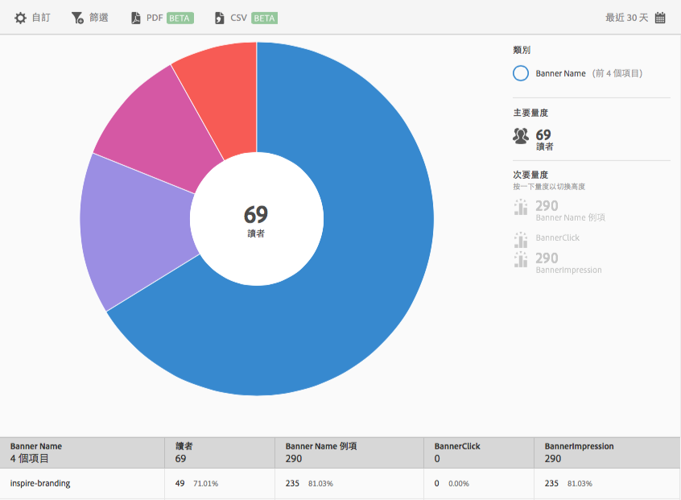

# 橫幅量度 {#banner-metrics}

「**[!UICONTROL 橫幅量度]」報表可以用散射環視覺效果呈現現有資料。**&#x200B;此報表僅限 Digital Publishing Suites (DPS) 客戶使用。

根據預設，此報表會顯示下列量度:

* **[!UICONTROL 橫幅名稱]**，即為橫幅的名稱。
* **[!UICONTROL 讀者]**，即為應用程式使用者人數。
* **[!UICONTROL 橫幅名稱例項]**，即為透過點按和曝光參照橫幅的次數。
* **[!UICONTROL 橫幅點按]**，即為使用者點按橫幅的次數。
* **[!UICONTROL 橫幅曝光次數]**，瀏覽器頁面上橫幅被檢視 (或顯示) 的次數。

此報表類似於「**[!UICONTROL 技術]」報表。**&#x200B;如需如何導覽與使用散射環報表、加入劃分和量度、建立 Target 活動、建立嚴格篩選以及共用報表的相關資訊，請參閱[技術](/help/using/usage/reports-technology.md)。此主題中的資訊可以用來自訂&#x200B;**[!UICONTROL 「橫幅量度」]報表。**
