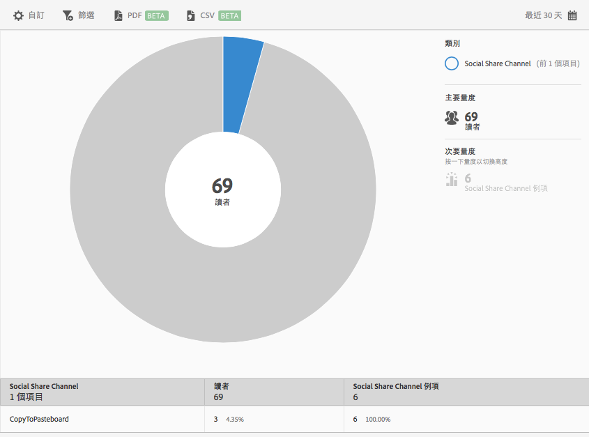

# 社交分享{#social-sharing}

「**[!UICONTROL 社交分享]**」報表可以用散射環視覺效果呈現現有資料。此報表僅限 DPS 客戶使用。

根據預設，此報表會顯示在不同管道 (例如電子郵件、訊息等) 分享文章的讀者人數。

此報表類似於「**[!UICONTROL 技術]**」報表。如需如何導覽與使用散射環報表、加入劃分和量度、建立 Target 活動、建立嚴格篩選以及共用報表的相關資訊，請參閱[技術](//help/using/usage/reports-technology.md)。「技術」主題中的資訊可以用來自訂「**[!UICONTROL 社交分享]**」報表。
