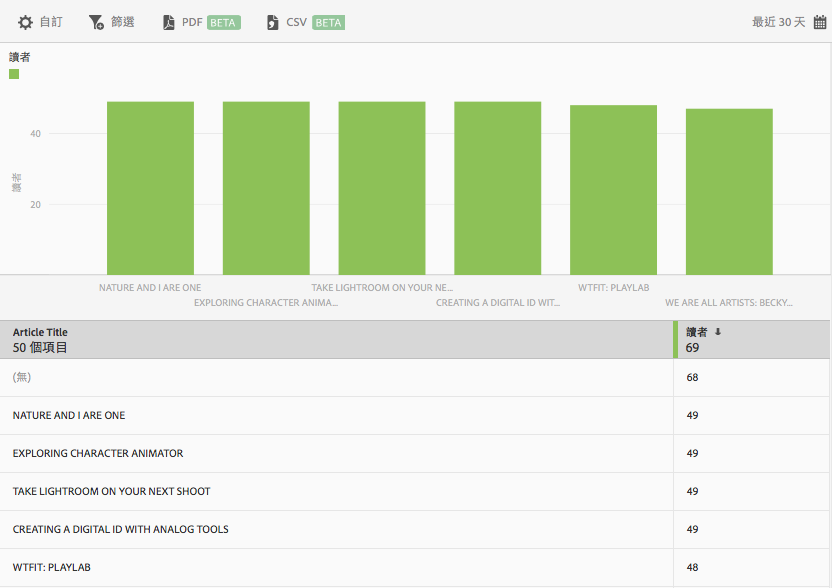

# 前 50 名文章報表{#top-articles}

**[!UICONTROL 前 50 名文章]**&#x200B;報表可顯示橫條圖和排名報表，用以顯示使用應用程式閱讀次數最多的文章。此報表僅限 DPS 客戶使用。

預設報表會依讀者人數顯示最近 30 天的資料，但您可自訂報表。

依預設，此報表會顯示文章標題和讀者人數。

您可以為此報表配置下列選項:

* **[!UICONTROL 時段]**
按一下**[!UICONTROL 日曆]**&#x200B;圖示以選取自訂時段，或從下拉式清單中選擇預設時段。

* **[!UICONTROL 自訂]**

   您可以透過變更&#x200B;**[!UICONTROL 「顯示方式」]選項、新增量度和篩選器以及新增其他系列 (量度) 等方式來自訂報表.**&#x200B;如需詳細資訊，請參閱[自訂報表](/help/using/usage/reports-customize/reports-customize.md)。

* **[!UICONTROL 篩選]**

   按一下&#x200B;**[!UICONTROL 「篩選」]可以建立跨越不同報表的篩選器，以查看在所有行動報表中的表現情形。**&#x200B;嚴格篩選可讓您定義套用到所有非路徑報表的篩選器。如需詳細資訊，請參閱[新增嚴格篩選](/help/using/usage/reports-customize/t-sticky-filter.md)。

* **[!UICONTROL 下載]**

   按一下 **[!UICONTROL PDF]** 或 **[!UICONTROL CSV]** 可下載或開啟文件，以及分享給無法存取 Mobile Services 的使用者，或是在簡報中使用檔案。