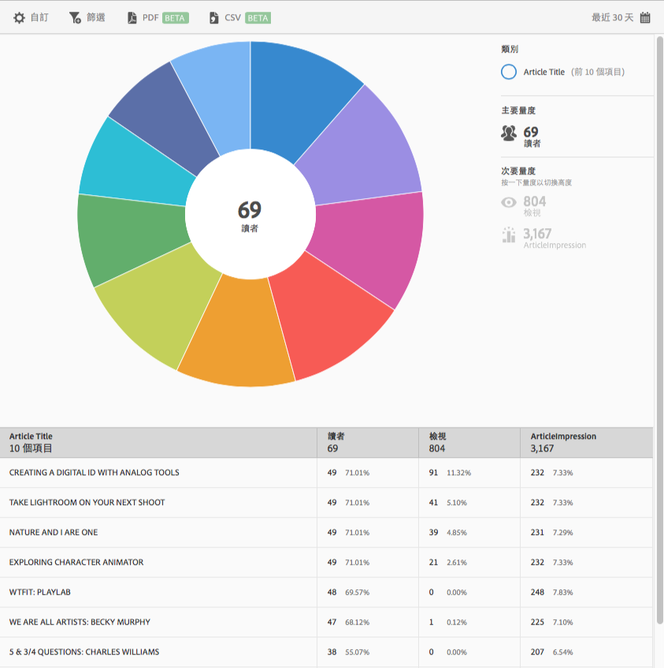

# 前 10 名文章 報告{#top-articles}

**[!UICONTROL 前 10 名文章]**&#x200B;報表可以用散射環視覺效果呈現資料。此報表僅限 DPS 客戶使用。

依預設，此報表會顯示文章標題、讀者人數和讀者總人數百分比，以及文章標題例項和百分比。

此報表類似於「**[!UICONTROL 技術]**」報表。如需如何導覽與使用散射環報表、加入劃分和量度、建立 Target 活動、建立嚴格篩選以及共用報表的相關資訊，請參閱[技術](/help/using/usage/reports-technology.md)。這些資訊可用於自訂&#x200B;**[!UICONTROL 前 10 名文章]**&#x200B;報表。
