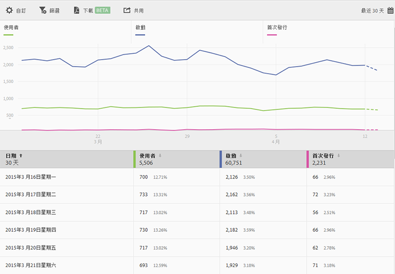
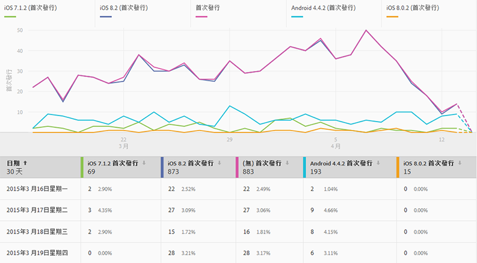
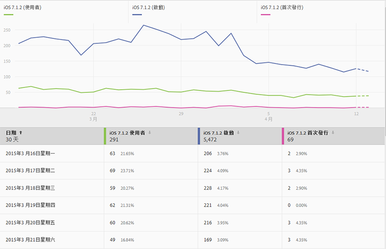
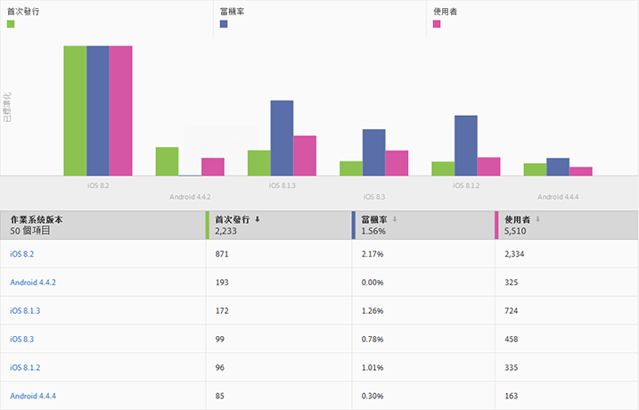
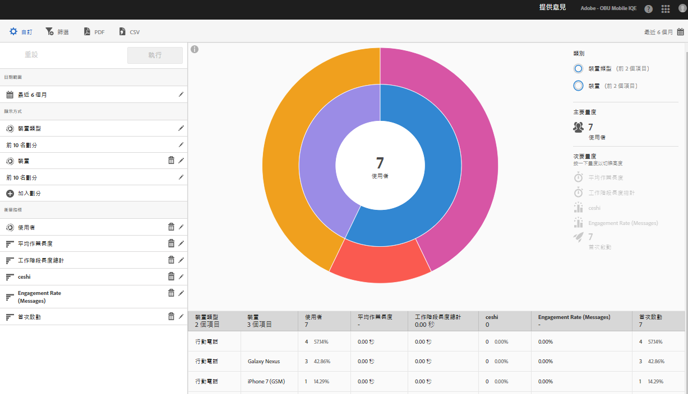
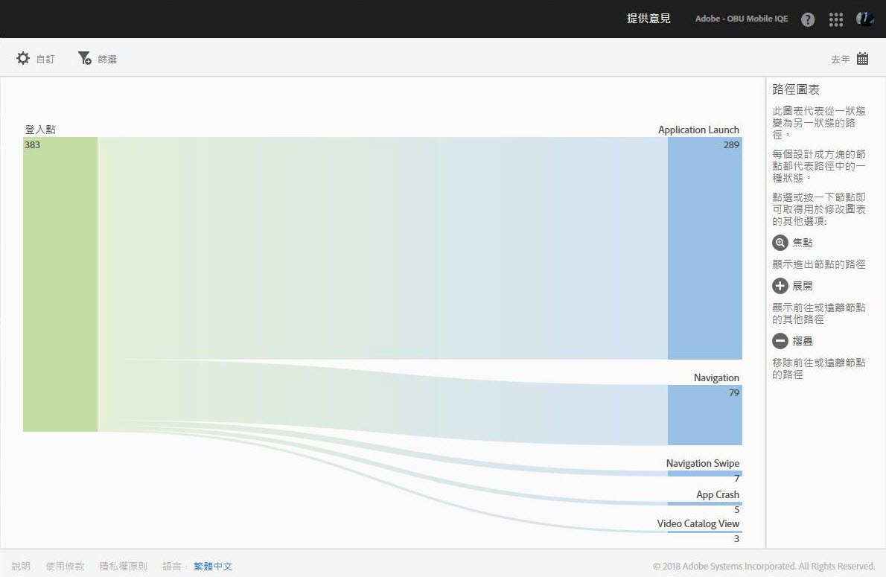
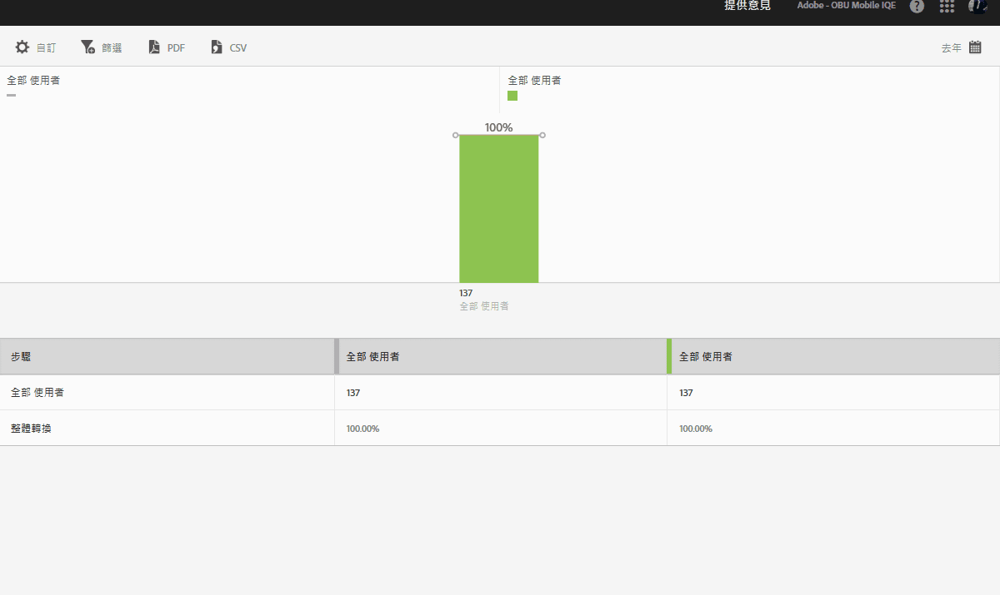

# 報表類型 {#report-types}

自訂報表時，廣泛的靈活性對於最適合取得您需要之資料的報表類型，可能會造成一些問題。

自訂報表之前，您應先瞭解量度和維度之間的差異。

* 量度

   量度可用來測量資料。量度是值，可以計數和相加，並用來查看應用程式中特定動作的發生頻率。常見量度有安裝、啟動、收入、期限值、登入。例如，每次您的應用程式啟動時，_launches_value 都會增加 1。

* 維度

   維度可用於描述資料。維度是以字串或像是字串的數字 (如郵遞區號) 來表示，用來組織和劃分資料。例如: 作業系統版本、促銷活動名稱、產品名稱、行動電信業者。每個維度都有一組相關聯的特定值，例如，作業系統版本維度有 _iOS 7_ 和 _Android 4.1.2_ 之類的值。

以下是您可在 Adobe Mobile 使用者介面中產生的報表類型:

## 時相報表 {#section_2741DA54C90C49AFB17C7B9BC7AD627D}

時相報表會顯示量度在某時間範圍中的表現情形，以讓您快速找出尖峰和趨勢。我們通常是從時相報表開始進行分析，然後在您想要深入研究可能是哪些因素促成該量度尖峰或趨勢時，再移到趨勢報表和排名報表。

例如，如果啟動次數量值出現尖峰，您可執行趨勢報表，報表會顯示前 5 個作業系統的啟動次數，然後您再查看哪些作業系統是促成啟動次數尖峰的最大貢獻者:

若要在時相報表中檢視維度值以及其他量度，可以使用例項量度，然後定義維度篩選器。

## 趨勢報表{#section_C9BE9A2EDBFF4D938B9AF14C8AA67883}

趨勢報表可讓您查看最常用的維度相對於量度的成效。透過此報表，您可以找出哪些值是促成量度變化的主因。

若要檢視某維度的趨勢報表，可在時相報表上加入嚴格篩選 (例如，作業系統 = iOS 6.0.1)，即可檢視相同資料。此外，您還可在已套用篩選的時相報表中額外加入五個量度。

## 篩選過的時相報表 {#section_F8FAF2A4496F449CA99EF1E052C71A2D}

如果有想要檢視的特定維度值，可以在時相報表加入嚴格篩選。以下報表顯示特定作業系統版本在 30 天內的啟動、升級、當機次數。

## 排名報表 {#section_C073D744A95843AF99EE74FB5B013735}

排名報表會顯示前 50 個維度對特定量度的貢獻頻率。想檢視某日期範圍對許多值的總貢獻時，此報表很實用。

## 散射環報表{#section_17A9842039174DE094A6B1E9837E35BB}

散射環報表可提供基礎報表與劃分之類的資料。視覺效果會利用高度來呈現量度及各量度間的績效差異。每個同心圓皆代表該圓類別中的某個對象區段。您可以對對象執行動作，例如套用嚴格篩選、隱藏量度和檢視量度。

您可以從報表檢視產品內教學課程，此教學課程將說明散射環圖的使用方式。

開始教學課程的方式:

1. 按一下「管理應用程式設定」中的&#x200B;**[!UICONTROL 使用狀況]**。

1. 依序按一下&#x200B;**[!UICONTROL 技術** &gt; ]**[!UICONTROL 技術劃分]**。
1. 在報表標題列中，依序按一下&#x200B;**[!UICONTROL 自訂]**&#x200B;和資訊圖示。

### 路徑報表 {#section_AD400106BC684B50B27CCCD3F4497114}

「路徑」報表可依據路徑分析顯示路徑圖表，用來代表使用者在應用程式中從某狀態轉換到另一個狀態所採行的路徑。

每個節點 (方塊狀) 代表使用者瀏覽應用程式時所採行之路徑中的一個狀態。例如，在上圖中，頂端節點代表啟動應用程式後接著從圖庫中挑選相片的使用者人數。

### 漏斗報表{#section_AF3B0C899D844FC3AD1F91A2C452C92F}

漏斗報表可讓您識別客戶在與您的行動應用程式互動時，在哪個位置離開促銷活動或是從定義的轉換路徑轉向。您也可以使用「漏斗」報表來比較不同區段的動作。

漏斗視覺效果可供您查看客戶於何處退出流程。洞察客戶在每個步驟的決策，可讓您瞭解他們在哪裡停住不再往前、傾向採取哪個路徑，以及何時離開您的應用程式。

