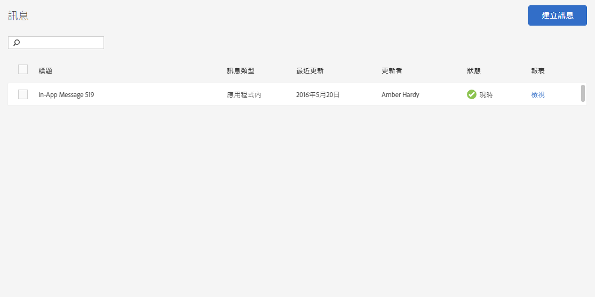

# 管理訊息{#manage-messages}

檢視應用程式內和推送訊息的清單，包含每個訊息的上次更新時間及其狀態 (使用中或停用) 的相關資訊。

您可以複製、啟用/停用以及封存/取消封存訊息。您也可以檢視報表，以瞭解已檢視訊息的使用者數目以及已點進訊息的使用者數目。

若要管理訊息，請按一下&#x200B;***「your_app_name*** > **[!UICONTROL 傳訊]** > **[!UICONTROL 管理訊息」]**。

以下是您可對訊息執行之工作的其他相關資訊：

* **搜尋及篩選訊息**

   使用清單頂端的搜尋方塊來搜尋及篩選訊息。您在搜尋方塊中輸入任何內容後，清單中都會顯示相符的訊息。搜尋可在所有表格欄間運作。例如，您可以輸入 `Draft`，而僅顯示具有該狀態的訊息。您也可以輸入使用者的名稱以僅顯示該使用者所更新之訊息。

   除了搜尋方塊之外，您也可以按一下任何欄標題，依該欄的內容以升序或降序方式排序清單。

   例如，如果您以升序來排序&#x200B;**[!UICONTROL 訊息類型]**&#x200B;欄位，在您推送訊息之前會顯示所有應用程式內訊息。如果您以降序來排序&#x200B;**[!UICONTROL 「最近更新」]**&#x200B;欄，清單會在頂端顯示最近更新的訊息。

* **複製訊息**

   1. 選取一或多個訊息旁的核取方塊，然後按一下&#x200B;**[!UICONTROL 複製選取的項目]**。
   1. 選取您要為其產生重複訊息的應用程式。
   1. 輸入訊息的名稱。

      若要複製相同應用程式的訊息，請為訊息輸入新名稱。如果保留相同的名稱，則會覆寫原始訊息。如果您是為不同應用程式複製訊息，則可維持相同名稱，不會覆寫原本的訊息。

   1. 視需要按一下&#x200B;**[!UICONTROL 複製]**&#x200B;或&#x200B;**[!UICONTROL 覆寫]**。

* **停用或啟用訊息**

   若要停用訊息，請選取至少一個使用中訊息旁邊的核取方塊，然後按一下&#x200B;**[!UICONTROL 停用選取的項目]**。

   若要啟用訊息，請選取至少一個停用中訊息旁邊的核取方塊，然後按一下&#x200B;**[!UICONTROL 啟用選取的項目]**。

* **封存訊息**

   若要封存訊息和清理訊息清單:

   >[!TIP]
   >
   >封存訊息之前，您必須先將訊息停用。

   1. 請選取至少一個停用中訊息旁邊的核取方塊，然後按一下&#x200B;**[!UICONTROL 封存選取的項目]**。

* **檢視封存的訊息**

   1. 按一下&#x200B;**[!UICONTROL 檢視封存]**。
   1. 請選取至少一個已封存訊息旁邊的核取方塊，然後按一下&#x200B;**[!UICONTROL 取消封存選取的項目]**。

