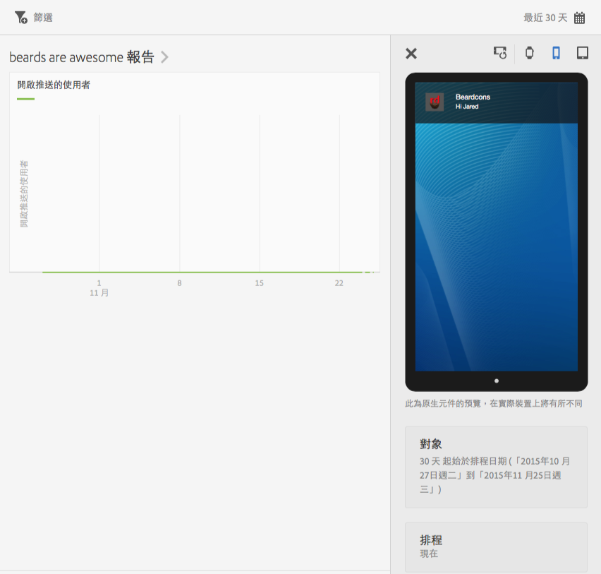
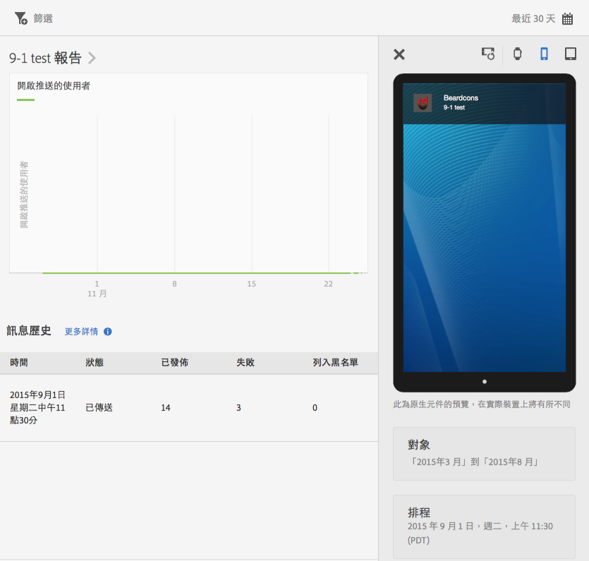

# 檢視訊息報表{#view-message-reports}

您可以檢視應用程式內和推送訊息的訊息報表。

1. 按一下欄中的 **[!UICONTROL 報表圖示]** 即可檢視訊息。
1. (**選擇性**) 為報表建立嚴格篩選，或按一下&#x200B;**[!UICONTROL 日曆]**&#x200B;圖示來變更時段。

   如需建立嚴格篩選的詳細資訊，請參閱[新增嚴格篩選](/help/using/usage/reports-customize/t-sticky-filter.md)。

>[!TIP]
>
>報表會隨著您檢視的訊息類型而有所不同。

## 應用程式內訊息 {#section_90B79BA58E8141F78538C187EB1BF8C7}

如果您檢視的是應用程式內訊息的報表，報表外觀會類似於下圖:

### 應用程式內訊息量度

以下是可用於應用程式內訊息的量度清單:

* **[!UICONTROL 曝光次數]**，即訊息觸發時。

* **[!UICONTROL 點進次數]**，即使用者按下警示或全螢幕訊息的&#x200B;**[!UICONTROL 點進]**&#x200B;按鈕時；以及使用者從本機通知開啟應用程式時。

* **[!UICONTROL 取消次數]**，即使用者按下警示或全螢幕訊息的&#x200B;**[!UICONTROL 取消]**&#x200B;按鈕時。

* **[!UICONTROL 參與率]**，這是 Adobe Analytics 的計算量度，此值是點進次數除以曝光次數所得的結果。

## 推送訊息 {#section_BEAFD858CA194185B6F88903446058E9}

如果您檢視的是推送訊息的報表，報表外觀會類似於下圖:

頂端圖表顯示開啟訊息的使用者人數。

### 推送訊息量度

以下是可用於推送訊息的量度清單:

* **[!UICONTROL 時間]**

   從 Mobile Services 推送訊息至裝置的時間。

* **[!UICONTROL 狀態]**

   訊息的狀態，可用的狀態如下:

   * **[!UICONTROL 已取消]**
   * **[!UICONTROL 已排程]**
   * **[!UICONTROL 執行中]**
   * **[!UICONTROL 已執行]**

* **[!UICONTROL 已發佈]**

   成功傳送至 Apple 推送通知服務/Firebase 雲端通訊 (APNS/FCM) 以傳送訊息至使用者裝置的裝置代號數量。

* **[!UICONTROL 顯示]**

   未成功傳送至 APNS/FCM 的裝置代號數量。失敗的可能原因:

   * pushID 無效

   * 指定的目標推送平台 (APNS、FCM 等) 不適用於該工作的應用程式。例如，平台可能會收集iOS推播Token，但未設定APNS服務。

   * 訊息可能因推送服務未正確設定或Mobile Services系統關閉而失敗。
   >[!IMPORTANT]
   >
   >如果您有異常大量的失敗，請檢查您的推播服務設定。 如果推播服務似乎已正確設定，請連絡Adobe客戶服務。

* **[!UICONTROL 拒絕清單]**

   已無效而不可傳送至 APNS 或 FCM 的裝置代號數量。這通常表示裝置已解除安裝應用程式，或使用者變更其接收訊息的選擇加入設定。Android和iOS對於預付碼被計為區塊清單的時間不同。 Android Token會立即顯示在拒絕清單（區塊清單）計數中。 iOS Token最初會顯示為已發佈，但根據來自APNS的回饋，會顯示為後續訊息上的區塊。
