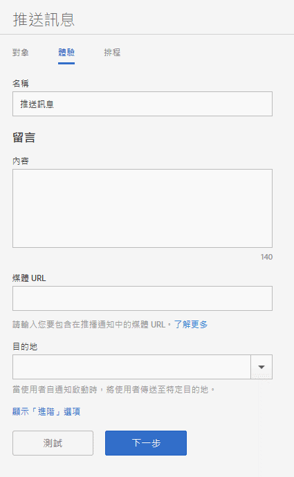

# Experience: push message {#experience-push-message}

您可以設定推送訊息和豐富推送訊息的體驗選項，包括名稱、訊息文字和目的地選項。您也可以配置進階選項，包含 iOS 裝置的裝載選項和自訂選項。

1. 在「對象」頁面上，按一下「體 **[!UICONTROL 驗」]**。

   

1. 輸入此訊息的名稱。
1. 在&#x200B;**[!UICONTROL 訊息]區段的下列欄位中輸入資訊:**

   * **[!UICONTROL 內容]**

      指定訊息的文字。您最多可以指定 140 個字元。

   * **[!UICONTROL 媒體 URL]**

      輸入您打算用於推送通知訊息的媒體檔案 URL。如需使用豐富式推播通知的需求，請參 *閱下方的豐富式推播通知需求* 。

      >[!IMPORTANT]
      >
      >若要在推送通知中顯示影像或影片，請記住以下事項:
      > * `attachment-url` 資料會在推送裝載中處理。
      > * 媒體 URL 必須可以處理尖峰請求。

   * **[!UICONTROL 目標]**

      選取當使用者點進訊息時要傳送給他們的特定目的地 (例如網頁、深層或混合式連結)。For more information, see [Destinations](/help/using/acquisition-main/c-create-destinations.md).

      >[!TIP]
      >
      >When you use the * **[!UICONTROL Web Link]** or **[!UICONTROL Custom Link]** destination types, the destination type is not tracked. 系統只會追蹤&#x200B;**[!UICONTROL 深層連結]。**

## 多樣化推播通知的需求

Here are the requirements for sending rich push notifications:

* **支援的版本**

   下列版本支援豐富式推播通知：
   * Android 4.1.0 或更新版本
   * iOS 10 或更新版本

      >[!IMPORTANT]
      >
      >請記住以下資訊:
      >* 傳送至舊版的豐富式推播訊息仍會傳送，但只會顯示文字。
      >* 目前不支援監看功能。

* **檔案格式**

   以下是支援的檔案格式:
   * 影像: JPG 和 PNG
   * 動畫 (僅限 iOS): GIF
   * 影片 (僅限 iOS): MP4

* **URL Formats**
   * 僅限 HTTPS

* **大小調整**
   * 影像必須是2:1格式，否則會遭到裁切。

如需關於設定豐富推送通知的詳細資訊，請參閱下列內容:

* [在Android中接收推播通知](/help/android/messaging-main/push-messaging/c-set-up-rich-push-notif-android.md)
* [Receive Rich Push Notifications in iOS](/help/ios/messaging-main/push-messaging/c-set-up-rich-push-notif-ios.md)

To configure a push message on the Experience page:

1. (**Optional**) Click the **[!UICONTROL Show Advanced Options]** link to configure additional options:

   * **[!UICONTROL 裝載: 資料]**

      在 JSON 提供自訂的推送裝載，並會透過推送或本機通知傳送至應用程式。Android 和 iOS 的上限為 4KB。

   * **[!UICONTROL Apple 選項: 類別]**

      提供推送和本機通知的類別。如需詳細資訊，請參閱 *iOS Developer Library (iOS 開發人員資料庫)* 中的[管理您的應用程式通知支援](https://developer.apple.com/library/content/documentation/NetworkingInternet/Conceptual/RemoteNotificationsPG/SupportingNotificationsinYourApp.html#//apple_ref/doc/uid/TP40008194-CH4-SW9)。

   * **[!UICONTROL Apple 選項: 聲音]**

      提供應用程式套件中要播放的聲音檔之檔名。如果未設定，則會播放預設警示聲。如需詳細資訊，請參閱 *iOS Developer Library (iOS 開發人員資料庫)* 中的[管理您的應用程式通知支援](https://developer.apple.com/library/content/documentation/NetworkingInternet/Conceptual/RemoteNotificationsPG/SupportingNotificationsinYourApp.html#//apple_ref/doc/uid/TP40008194-CH4-SW10)。

   * **[!UICONTROL Apple 選項: 可用內容]**

      選取此選項，以便在訊息到達時，iOS 會在背景喚醒應用程式，並允許應用程式根據訊息裝載執行代碼。For more information, see [Apple Push Notification Service](https://developer.apple.com/library/content/documentation/NetworkingInternet/Conceptual/RemoteNotificationsPG/APNSOverview.html#//apple_ref/doc/uid/TP40008194-CH8-SW1) in the *iOS Developer Library*.

1. (可選) 按下列圖示以預覽訊息的配置:

   * **[!UICONCONTROL x Summary}**

      隱藏預覽窗格。 Click preview to display the preview pane again.

   * **[!UICONTROL Change the orientation]**

      To change the orientation of the preview from portrait to landscape mode, click . 若是手錶，方向會從圓形錶面變更為方形錶面。

   * **[!UICONTROL 在使用者的觀看中預覽]**

      若要預覽訊息在使用者的手錶上的顯示效果，請按一下「監 。

   * **[!UICONTROL 在使用者的行動電話上預覽]**

      To preview your message as it will appear on a users's mobile phones click phone icon.

   * **[!UICONTROL 在使用者的平板電腦上預覽]**

      若要在使用者的平板電腦中預覽訊息，請按一下平板電 。
   在預覽窗格底部，您可以檢視上一步驟所選對象的說明。

1. (**Optional**) Click **[!UICONTROL Test]** to push your message to specified devices for testing purposes.
1. 選取服務並輸入至少一個想要推送訊息的裝置之推送代號。

   以逗號分隔的清單指定代號，即可推送訊息至一個以上裝置。

1. 設定 消息的調度選項。

   如需詳細資訊，請參閱 [排程：推播訊息](/help/using/in-app-messaging/t-create-push-message/c-schedule-push-message.md)。
