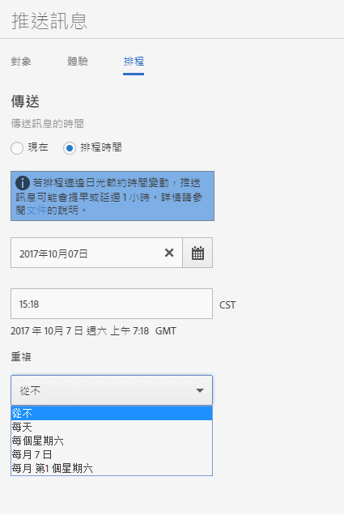

# 排程：推播訊息{#schedule-push-message}

在 Adobe Mobile Services UI 中，您可以排程推送訊息的傳遞時間，如立即傳遞、稍後傳遞以及設為週期性事件。這些事件可以排程為每日發生、每週發生或每月發生。

>[!TIP]
>
>使用者可隨時修改推送訊息工作的排程設定。若沒有適用的日期可傳送重複排程訊息，例如每個月第 31 天的每月重複工作，則 2 月 31 日或當月 5 日星期二，則不會傳送訊息。

請記住以下資訊:

* The correct date and time format is `hh:mm` and `mm/dd/yyyy`.

* 您可透過下列方式編輯已排程訊息:

   * 將日期變更為稍後日期。
   * 將重複間隔變更為其他間隔。

      例如，若您原本有每天傳送的訊息，您可將頻率切換為每週傳送。

## 排程週期性推送訊息之前

您&#x200B;**務必**&#x200B;先瞭解下列資訊再開始排程重複推送訊息:

* **[!UICONTROL 「重複」]下拉式清單所顯示的選項視您輸入或選取的日期而定。**

   例如，如果您輸入 `Saturday, October 7`，則會顯示下列選項：

   * **[!UICONTROL 從不]**
   * **[!UICONTROL 每天]**
   * **[!UICONTROL 每個星期六]**
   * **[!UICONTROL 每個月的第　7　天]**
   * **[!UICONTROL 每個月的第一個星期六]**

* 推送訊息會根據格林威治標準時間 (GMT) 排程及傳送。

   例如，若您將重複訊息排程於自 10 月 7 日開始，在每個星期六的 12:00 pm **PST** 傳送，則實際傳送訊息的時間會是星期六的 7 pm **GMT**。
* 視您位於美國、歐洲或亞洲而定，訊息傳送時間會有所不同。

   例如，若您位於加州聖荷西，且您將訊息排程於 ***10 月 31 日**的* 5:30 pm **PST** 傳送，則實際傳送訊息的時間會是 ***11 月 1 日**的* 12:30 am **GMT**。若您位於東京，且您將訊息排程於 ***1 月 1 日**的* 5:30 am 傳送，則訊息將於 ***12 月 31 日**的* 8:30 pm **GMT** 傳送。
* 推送訊息會早一小時或晚一小時傳送，取決於是否使用日光節約時間。
* 當您查看推送訊息報表時，訊息會以您系統的當地時區顯示。

   例如，若您的開始時間為 12:00 pm **PST**，即使訊息的傳送時間為 7pm **GMT**，訊息報表顯示的傳送時間仍會是 12:00 pm **PST**。

## Schedule a recurring push message {#section_675BD754E5A04423A1751193698A978F}

1. 在新推播訊息的「計劃」頁面上，選取 **[!UICONTROL 「已排程」]** 或「 **[!UICONTROL 現在」]**。

   For more information, see [Create a push message](/help/using/in-app-messaging/t-create-push-message/t-create-push-message.md).

   If you selected **[!UICONTROL Now]**, the message is pushed immediately. To prevent the message from being scheduled immediately, click **[!UICONTROL Save as Draft]**.

   

1. If you selected **[!UICONTROL Scheduled]**, click the calendar icon and select or type a start date.
1. 輸入時間。 
1. **[!UICONTROL 在「重復」]**&#x200B;下方，選取下列其中一個選項：

   * **[!UICONTROL 從不]**
   * **[!UICONTROL 每天]**
   * **[!UICONTROL 每個星期二]**
   * **`<Day x>`本月**

      視您選取或輸入的開始日而定，所顯示的選項會有所不同。
   * **`<nth day>`每個月**

      視您選取或輸入的開始日期而定，所顯示的值會有所不同。

1. In **[!UICONTROL End Repeat]**, type an end date and time.
1. 按一下下列其中一個選項:

   * **[!UICONTROL 另存為草稿]**

      此選項會以草稿格式儲存訊息。選擇此選項可以儲存尚未完成的訊息，或是儲存訊息以供其他人編輯並核准，之後再加以啟用。

      If you selected **[!UICONTROL Now]** in the previous step, the draft message is sent immediately on activation. 如果您選取推送訊息的日期和時間，則訊息會根據此排程推送。

   * **[!UICONTROL 儲存與排程]**

      此選項會在排程日和時間傳送訊息。

若要稍後推送草稿訊息，請完成下列其中一項作業:

* Click **[!UICONTROL Manage Messages]**, select the check box next to the message, and click **[!UICONTROL Activate Selected]**.
* 按一下「**[!UICONTROL 儲存和傳送]」，儲存訊息並將其啟用。**
