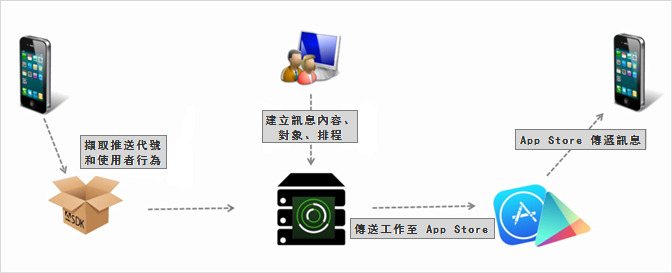

# 建立推送訊息 {#create-a-push-message}

您可以從 Mobile Services UI 傳送推送訊息至 Analytics 區段，以便在與使用者互動時，運用健全的 Analytics 資料。

>[!IMPORTANT]
>
>建立推送訊息之前，請參閱[啟用推送訊息的必要條件](/help/using/c-manage-app-settings/c-mob-confg-app/configure-push-messaging/prerequisites-push-messaging.md)。

當選擇接收通知的使用者目前未使用您的應用程式時，就會對這些使用者顯示推播訊息。這些通知會對使用者提供有關於可用更新、選件和提醒的警報。透過這些通知，您可以透過簡化的統一工作流程建立、測試、管理和報告推送訊息。

推播訊息會由應用程式商店在伺服器端傳送，而非從 Adobe Mobile Services 傳送：

若要建立推播訊息：

1. 按一下&#x200B;***「your_app_name*** > **[!UICONTROL 傳訊]** > **[!UICONTROL 管理訊息]** > **[!UICONTROL 建立訊息]** > **[!UICONTROL 建立推播」]**。
1. 設定對象選項。

   如需詳細資訊，請參閱[對象: 定義並設定推送訊息的對象區段](/help/using/in-app-messaging/t-create-push-message/c-audience-push-message.md)。
