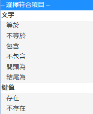

# 對象: 應用程式內訊息 {#audience-in-app-message}

{#eol}

您可以設定應用程式內訊息的對象選項，包含檢視、觸發器和特徵選項。

1. 在您的應用程式中，依序按一下&#x200B;**[!UICONTROL 「傳訊]** > **[!UICONTROL 管理訊息]** > **[!UICONTROL 建立訊息]** > **[!UICONTROL 建立應用程式內訊息」]**。
1. 在對象頁面的下列欄位輸入資訊:

   * **[!UICONTROL 檢視]**

      選取觸發訊息顯示的選項:

      * **[!UICONTROL 一直]**

         此選項表示訊息會在每次觸發時顯示。

      * **[!UICONTROL 一次]**

         此選項表示訊息只會在第一次觸發時顯示。

      * **[!UICONTROL 直至點進訊息]**

         此選項表示訊息會在每次觸發時顯示，直至使用者點進訊息為止。此觸發器只適用於全螢幕和警告訊息。大多數的訊息需要重新導向或使用來自網際網路的資源，因此離線時無法顯示。若要無論網絡連線一律顯示訊息，請選取&#x200B;**[!UICONTROL 「離線顯示」]**&#x200B;核取方塊。
   * **[!UICONTROL 觸發]**

      從下拉式清單中選取選項，然後選取條件。例如，您可從第一個下拉式清單中選取「**[!UICONTROL 已啟動]**」，然後從第二個下拉式清單中選取「**[!UICONTROL 存在」。]**&#x200B;您也可以指定自訂內容資料，觸發點擊中必須包含該資料才會顯示訊息。

      >[!IMPORTANT]
      >
      >如果您選取多個觸發器，則點撃時必須觸發所有觸發器才會顯示訊息。

   * **[!UICONTROL 特徵]**
您可以決定觸發應用程式內訊息時可以看到該訊息的對象，並篩選 (區隔) 具有特定資料點擊的對象。例如，您可以定義一個規則，其中的地標包含丹佛。此篩選器能讓您對在觸發時間位於地標名稱包含丹佛的客戶顯示訊息。

## 有關特徵和觸發器的其他資訊 {#section_48C39EFB8CAA4F62B994FCC91DF588E6}

>[!IMPORTANT]
>
>觸發器和特徵使用從應用程式傳遞給 Analytics 的資料。這些值會以內容資料、已對應之變數和量度等形式傳遞。變數是以文字為主的值，量度則是數值。

若要在 Mobile Services 使用者介面中查看這些索引鍵/值組的對應，以及驗證觸發器的值，請按一下&#x200B;**[!UICONTROL 「管理應用程式設定]** > **[!UICONTROL 管理變數和量度」]**，以下索引標籤隨即出現：

* **[!UICONTROL 「標準變數與量度」]**
* **[!UICONTROL 自訂變數]**
* **[!UICONTROL 自訂量度]**

驗證對應後，請選取適當的符合項目或邏輯運算子，藉此設定訊息的對象。

### 選取量度和變數 {#example_AB126F03BD1C4094B791E230B3DB1189}

以下情境有助於您判斷應選取量度或變數來作為觸發器:

### 量度

量度是數值，購買次數即是一例。

1. 按一下&#x200B;**[!UICONTROL 「管理訊息]** > **[!UICONTROL 建立訊息」]**。
1. 在&#x200B;**[!UICONTROL 「對象」]**&#x200B;標籤的&#x200B;**[!UICONTROL 「觸發器」]**&#x200B;區段完成以下步驟:

   1. 選取標準事件 (如&#x200B;**[!UICONTROL 已啟動]**)，然後選取&#x200B;**[!UICONTROL 存在]**。
   1. 選取已對應到量度的自訂資料點來當做第二個觸發器。
   1. 在&#x200B;**[!UICONTROL 數量]**&#x200B;下方選取符合項目選項。

### 變數

變數是作為唯一識別碼的文字字串，範例包括國家、機場等。

1. 按一下&#x200B;**[!UICONTROL 「管理訊息]** > **[!UICONTROL 建立訊息」]**。
1. 在&#x200B;**[!UICONTROL 「對象」]**&#x200B;標籤的&#x200B;**[!UICONTROL 「觸發器」]**&#x200B;區段完成以下步驟:

   1. 選取標準事件 (如&#x200B;**[!UICONTROL 已啟動]**)，然後選取&#x200B;**[!UICONTROL 存在]**。
   1. 選取已對應到變數的自訂資料點來當做第二個觸發器。
   1. 在&#x200B;**[!UICONTROL 文字]**&#x200B;下方選取符合項目選項。

如需內容資料、變數及量度的詳細資訊，請參閱[管理應用程式](/help/using/manage-apps/manage-apps.md)。
