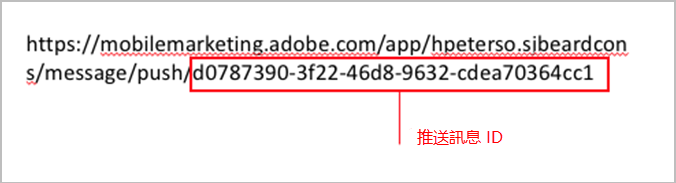
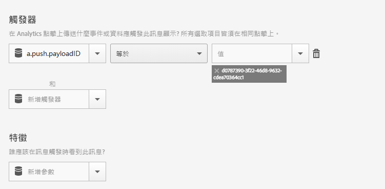

# Trigger an in-app message when the app is opened from a push message{#trigger-an-in-app-message-when-the-app-is-opened-from-a-push-message}

您可以將應用程式內訊息觸發器設為使用者從推送訊息開啟應用程式時系統傳送的推送訊息 ID。

1. 取得推送訊息的推送訊息 ID，系統會將該 ID 傳送給使用者。

   您可以在訊息建立工作流程，於 URL 找到推送訊息 ID。期間

   其範例如下:

   

1. 使用下列觸發器儲存並啟動應用程式內訊息:

   `“a.push.payloadID” =`

   >[!TIP]
   >
   >推播訊息ID是您在步驟1中找到的ID。

   由於&#x200B;**[!UICONTROL 觸發器]下拉式清單沒有此觸發器，因此您必須手動新增。**

   

1. 儲存並傳送推送訊息，該訊息具有您在步驟 1 找到的推送 ID。
1. 點進推送訊息以開啟應用程式，並確認應用程式會在開啟時顯示應用程式內訊息。

   測試時，請留意下列資訊:

   * 儲存應用程式內訊息後，託管的設定檔案約需 45 秒才會更新新訊息。
   * 應用程式會在&#x200B;**新**&#x200B;啟動時尋找設定檔案更新 (新的應用程式內訊息)，因此您必須確保當您按下推送訊息時，應用程式正在觸發新的啟動。
   這通常表示您必須確保已出現工作階段逾時。預設逾時為 5 分鐘。

