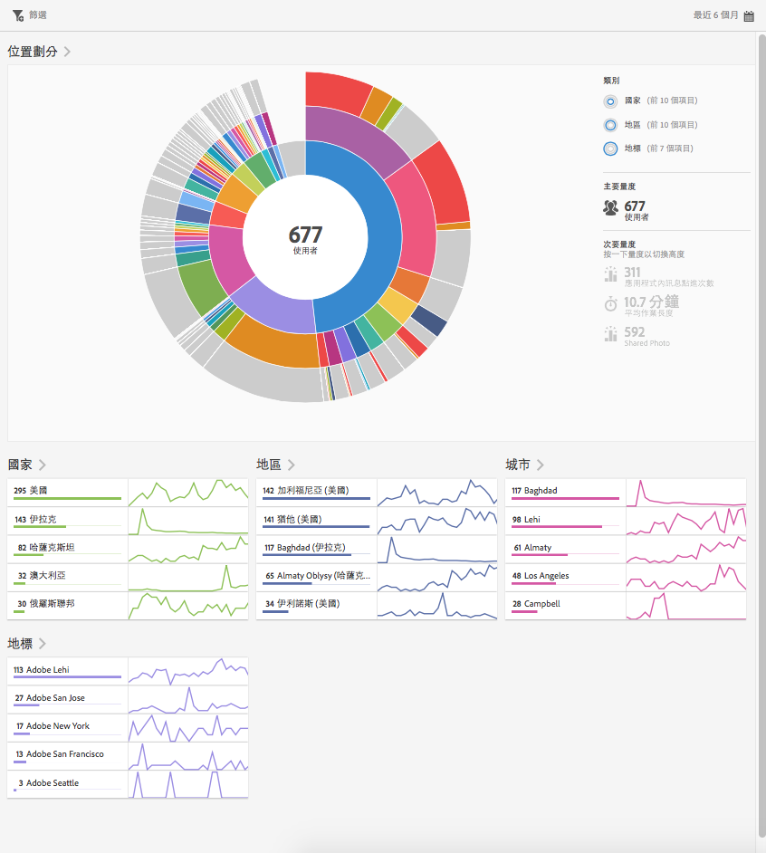

# 概述 (位置){#overview-location}

**[!UICONTROL 位置概述]**&#x200B;報表可讓您查看您的應用程式被用於哪些不同的國家、地區和地標 (POI)。

此報表以散射環視覺效果呈現您現有的資料，而您可以利用該報表探索目標的對象段 (訪客群)。建立及管理對象類似於建立及使用區段，但無法在 Experience Cloud 之中建立對象。

以下是關於此報表的其他資訊:

## 導覽及使用狀況 {#section_4A88C3849B5847BF8CF433CCFD99FDC3}

此視覺化可提供例如具有劃分的基本報表。 視覺化會使用高度來顯示焦點中的量度，以及量度之間的效能差異。 每個鈴聲代表鈴聲類別中的觀眾區隔。 您可以對對象採取動作，例如套用嚴格篩選、隱藏量度及檢視量度。

>[!TIP]
>
>除了此資訊外，您也可以檢視產品內的教學課程，該教學課程會說明如何與散射環圖互動。若想啟動教學課程，請按一下報表標題列中的&#x200B;**[!UICONTROL 「技術劃分」]**，然後按一下&#x200B;**[!UICONTROL 「i」]**&#x200B;圖示。

散射環圖是互動式的。按一下右上角的&#x200B;**[!UICONTROL 「日曆」]**&#x200B;圖示可以變更時段。將滑鼠移至圖表的任一部分，以顯示更多資訊。 例如，在下圖中，您可以看到在美國使用您應用程式的使用者總數和百分比。

在此圖中，使用右上角的&#x200B;**[!UICONTROL 類別]**&#x200B;按鈕，可以在前 10 個國家和地區以及前 3 個&#x200B;**[!UICONTROL 地標]**&#x200B;的相關資訊之間切換檢視。

以下是選取&#x200B;**[!UICONTROL 「國家/地區」時的視覺化呈現]**:

以下是選取&#x200B;**[!UICONTROL 「地標」時的視覺化呈現]**:

您可以按一下環中的某個片段，以選取您可在其上執行動作的對象，例如放大、隱藏對象、建立應用程式內訊息或嚴格篩選。

您可以按一下右側的次要量度，將其加入視覺效果中，並使用顏色、高度或兩者搭配以顯示此量度。

## 加入劃分和量度 {#section_15833511E82648869E7B1EFC24EF7B82}

您可以加入劃分和次要量度，這會變更每個對象相對於圖表中其他對象的高度。

>[!TIP]
>
>散射環中的環數越多，處理的時間就越久。

若想加入劃分和次要量度，請按一下報表標題列中的&#x200B;**[!UICONTROL 「位置劃分」]**，並按一下&#x200B;**[!UICONTROL 「自訂」]**&#x200B;開啟右側邊欄。

當您按一下&#x200B;**[!UICONTROL 加入劃分]**&#x200B;或&#x200B;**[!UICONTROL 新增量度]**，會在相應的清單中出現一個名稱與前一個項目相同的新項目。按一下新建立的劃分或量度，可存取一個下拉式清單並從中選取新項目。

## 建立嚴格篩選 {#section_365999D49FC744ECBF9273132497E06C}

按一下散射環中的某一塊，可以選取您要對其建立嚴格篩選的對象，然後按一下&#x200B;**[!UICONTROL 嚴格篩選]**。此嚴格篩選可讓您套用目前的篩選，並根據篩選執行新報表。

## 共用報表 {#section_F8AF2AA73D4C4C008976D45847F82D0B}

建立報表後，會使用您的設定建立自訂 URL，以供您複製和分享。

## 其他資訊

如需有關位置的詳細資訊，請參閱下列內容:

* [地圖](/help/using/location/c-map-points.md)
* [管理地標](/help/using/location/t-manage-points.md)