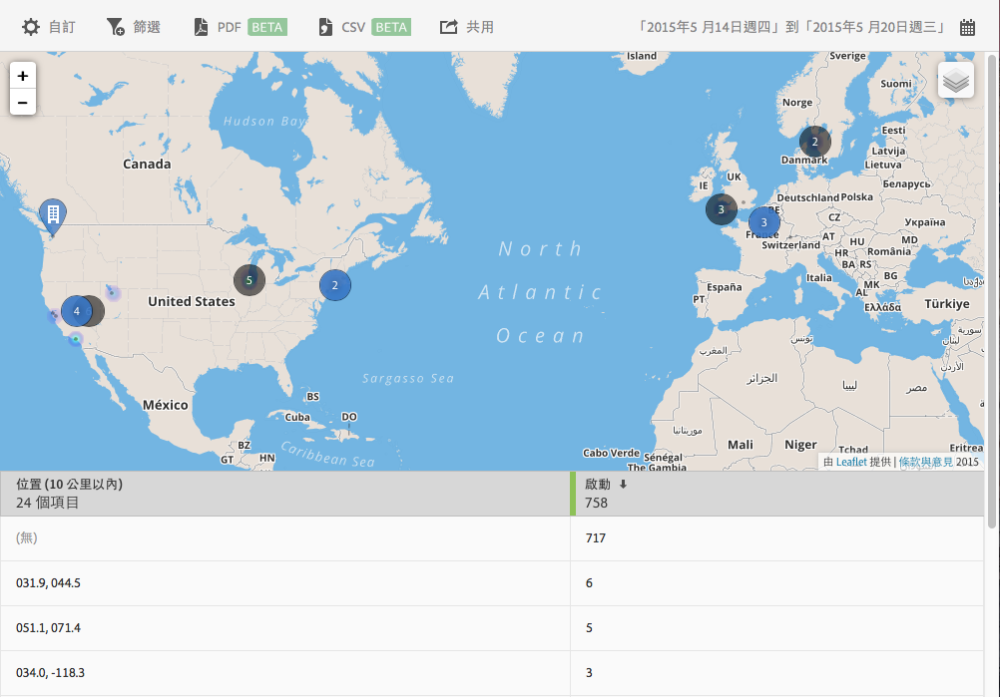

# 地圖 {#map}

您可以檢視可顯示您的 POI 與其他資料標記的互動地圖。

以下是一些需記住的重要資訊:

* 您可以放大或縮小地圖的大小。

   舉例來說，如果您有兩個距離很近的地標，這個功能就很有用。放大地圖可供您更詳細檢視地圖。
* 您的地標會以藍色顯示。

   其他資料標記 (例如啟動) 會以黑色顯示。按一下標記可以檢視更多資訊。

按一下可選取下列選項:

* **[!UICONTROL 地圖]**

   顯示簡單地圖。

* **[!UICONTROL 衛星]**
以衛星模式顯示地圖。

* **[!UICONTROL 資料標記]**

   選擇是否要顯示黑色的資料標記。

* **[!UICONTROL 熱度圖]**

   選擇是否要顯示熱度圖標記。色彩愈深，表示滿足條件 (例如啟動) 的頻率越高。

* **[!UICONTROL 地標]**

   選擇是否顯示地標。

您可以為此報表配置下列選項:

* **[!UICONTROL 時段]**

   按一下&#x200B;**[!UICONTROL 「日曆」]圖示以選取自訂時段，或從下拉式清單中選擇預設時段。**

* **[!UICONTROL 自訂]**

   您可以透過變更&#x200B;**[!UICONTROL 「顯示方式」]選項、新增量度和篩選器以及新增其他系列 (量度) 等方式來自訂報表.**&#x200B;如需詳細資訊，請參閱[自訂報表](/help/using/usage/reports-customize/t-reports-customize.md)。

* **[!UICONTROL 篩選]**

   按一下&#x200B;**[!UICONTROL 「篩選」]可以建立跨越不同報表的篩選器，以查看在所有行動報表中的表現情形。**&#x200B;嚴格篩選可讓您定義套用到所有非路徑報表的篩選器。如需詳細資訊，請參閱[新增嚴格篩選](/help/using/usage/reports-customize/t-sticky-filter.md)。

* **[!UICONTROL 下載]**

   按一下 **[!UICONTROL PDF]** 或 **[!UICONTROL CSV]** 可下載或開啟文件，以及分享給無法存取 Mobile Services 的使用者，或是在簡報中使用檔案。