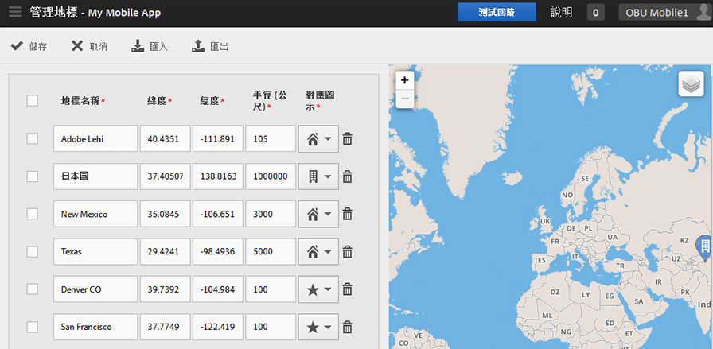

# 管理地標 {#manage-points-of-interest}

您可以建立和管理 POI，藉此定義地理位置，以便用於關聯、使用應用程式內訊息定位等等。從 POI 傳送點擊時，POI 就會附加至該點擊。

使用「位置」之前，請先確認下列要求:

* 您必須擁有 Analytics—Mobile Apps 或 Analytics Premium。
* 您必須啟用此應用程式的&#x200B;**[!UICONTROL 位置報表]**。
* 如果您使用的 iOS SDK 或 Android SDK 版本比 4.2 版舊，新增&#x200B;**[!UICONTROL 地標]**&#x200B;之後，您還必須下載新的設定檔案並提供給應用程式開發人員。

   如果您使用的是 iOS SDK 或 Android SDK 4.2 版或更新版本，就不需要再將應用程式更新提交至商店來更新&#x200B;**[!UICONTROL 地標]**。在「管理地標」頁面上按一下&#x200B;**[!UICONTROL 儲存]**&#x200B;時，變更會封裝至&#x200B;**[!UICONTROL 地標]**&#x200B;清單中，並更新即時應用程式的設定檔案。只要您的應用程式是使用更新的 SDK 和設定及遠端 POI URL，則儲存也會在使用者裝置上更新應用程式中的地標清單。

在使用者裝置上，必須為應用程式啟用位置，才能將點擊指派給&#x200B;**[!UICONTROL 地標]**。

若要使用「位置」，請完成下列作業:

1. 按一下應用程式的名稱，前往其「管理應用程式設定」頁面。
1. Click **[!UICONTROL Location]** > **[!UICONTROL Manage Points of Interest]**.

   

1. 在下列各欄位中輸入資訊:

   * **[!UICONTROL 地標名稱]**

      輸入&#x200B;**[!UICONTROL 位置地標]**&#x200B;名稱。

      這可以是城市、國家或地區的名稱。您也可以在特定位置附近建立&#x200B;**[!UICONTROL 地標]**，例如體育館或企業。

   * **[!UICONTROL 緯度]**

      輸入&#x200B;**[!UICONTROL 地標]**&#x200B;的緯度。您可從其他來源找到這項資訊，包括網際網路。

   * **[!UICONTROL 經度]**

      輸入&#x200B;**[!UICONTROL 地標]**&#x200B;的經度。您可從其他來源找到這項資訊，包括網際網路。

   * **[!UICONTROL 半徑 (公尺)]**

      輸入&#x200B;**[!UICONTROL 地標]**&#x200B;涵蓋的半徑 (公尺)。例如，如果您建立「科羅拉多州丹佛市」(Denver, Colorado) 的 POI，便可指定包含丹佛市與周邊地區，但不含科羅拉多泉 (Colorado Springs) 的半徑大小。

   * **[!UICONTROL 地圖圖示]**

      選取將顯示在[概述](/help/using/location/c-location-overview.md)和[地圖](/help/using/location/c-map-points.md)報表上的圖示。

1. 視需要新增其他 POI。

   建議您不要新增超過 5,000 個 POI。如果新增的地標超過 5,000 個，地標仍可儲存，但會收到警告訊息提醒您最佳實務作法是低於 5,000 個地標。

1. 按一下&#x200B;**[!UICONTROL 「儲存」]**。

若要刪除一或多個 POI，請選取適用的核取方塊，然後按一下&#x200B;**[!UICONTROL 移除選取的項目]**。

按一下&#x200B;**[!UICONTROL 匯入]**&#x200B;或&#x200B;**[!UICONTROL 匯出]**，即可透過 `.csv` 檔案使用資料，而不用透過 Adobe Mobile 使用者介面。
