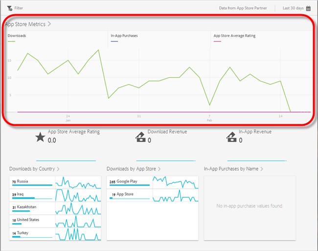
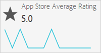
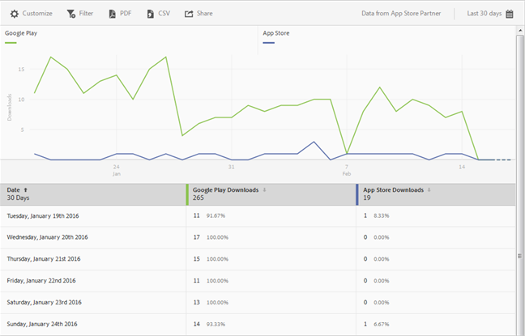
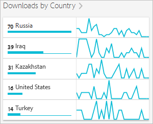
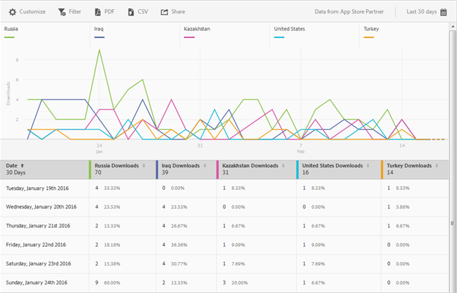
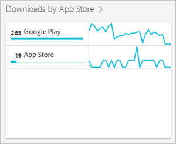

# App Store Overview report{#app-store-overview-report}

**[!UICONTROL 「App Store 概述」]報表可提供應用程式商店量度的快照，包括下載次數、應用程式內購買、App Store 平均評分、下載收入、應用程式內收入、依國家/地區的下載次數、依應用程式商店的下載次數，以及依名稱的應用程式內購買。**

>[!TIP]
>
>In the Mobile Services UI, the **[!UICONTROL App Store]** menu item and **[!UICONTROL Overview]** report appear in the left navigation menu after you configure the integration.

**[!UICONTROL 「概述」]報表包含特定時段圖形，可顯示應用程式商店下載次數、使用您的應用程式進行的應用程式內購買次數，以及您應用程式的平均評分。**

您可以按一下任何量度以隱藏或顯示該量度的對應行。若要檢視某一天的資料，請將滑鼠移到該日期上。

>[!IMPORTANT]
>
>Adobe Analytics中的應用程式商店量度(例如下載、排名、收入、評分等)需要與適當廠商整合。`appFigures` 目前提供整合功能，但您需要先`appFigures`向 **** 購買適當的產品及/或服務，才能啟用整合功能。如需 Data Connector 整合的詳細資訊，請參閱 [Adobe Exchange](https://www.adobeexchange.com/experiencecloud.html)。

>[!TIP]
>
>除了按一下右上方的日曆圖示變更報表的日期範圍外，您還可以自訂部分向下切入報表、新增篩選器和系列(量度)、新增嚴格篩選，以及以PDF或CSV格式下載報表。For more information, see [Customize reports](/help/using/usage/reports-customize/reports-customize.md).

## App Store 平均評分 {#section_60D0D21824AE4450BC3E34D7ACA12A7A}

此報表顯示使用者透過應用程式商店功能給予您應用程式的平均得分。

You can click anywhere on the **[!UICONTROL App Store Average Rating]** widget to display a graph and chart that displays the average rating by date. 若要檢視某一天的資料，請將滑鼠移到該日期上。

## 下載收入 {#section_34F05998E8444544A1B507C1B852C4EE}

此報表顯示透過下載您的應用程式而產生的收入。

## 應用程式內收入 {#section_58792ED9C4B54B7D836E30CF09E8E204}

此報表顯示使用您的應用程式進行應用程式內購買而產生的收入。

## 依國家/地區的下載次數 {#section_10373CD28CA94BA5859DFDEED7D548C6}

此報表顯示依國家/地區分組的應用程式下載次數。

To display a graph and chart that displays the number of downloads per country by date, click **[!UICONTROL Downloads by Country]**. 將滑鼠移到日期上，即可檢視當天的資料。

## 依應用程式商店的下載次數 {#section_F1CD1A3F0105469D879E4F280CE32484}

此報表顯示依應用程式商店分組的應用程式下載次數。

To display a graph and chart that displays the number of downloads per app store grouped by date, click **[!UICONTROL Downloads by App Store]**. 您可以將滑鼠移到日期上，即可檢視當天的資料。

## 依名稱的應用程式內購買 {#section_D747A64F9F6449E0A02EF31D56C92F83}

此報表依名稱顯示所有應用程式內的購買。
