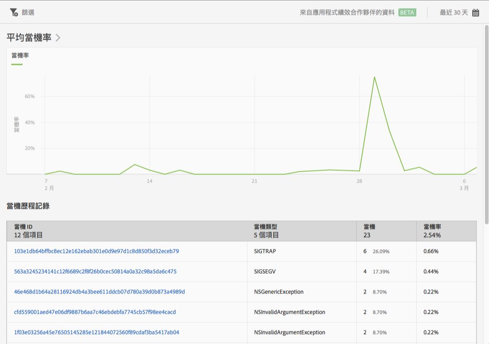

# 當機報表 {#crashes}

**[!UICONTROL 「當機」]**&#x200B;報表可提供應用程式當機的快照。您可以查看當機次數和當機率，以及登入 Apteligent 使用者介面。

>[!IMPORTANT]
>
>若要在左側導覽顯示&#x200B;**[!UICONTROL 當機]**&#x200B;報表，您必須先將應用程式與 Apteligent 整合。

**[!UICONTROL 平均當機率]**&#x200B;圖形會依日期顯示當機率。您可以將滑鼠移到任一日期上，即可檢視當天的當機率。

**[!UICONTROL 當機歷程記錄]**&#x200B;圖表顯示每次應用程式當機的相關資訊，包括當機 ID、當機類型、當機次數以及當機日期。若要登入 Apteligent 以檢視關於當機的更多詳情，請按一下&#x200B;**[!UICONTROL 「當機 ID」]**&#x200B;欄的連結。

您可以為此報表配置下列選項:

* **[!UICONTROL 時段]**

   按一下&#x200B;**[!UICONTROL 「日曆」]**&#x200B;圖示以選取自訂時段，或從下拉式清單中選擇預設時段。

* **[!UICONTROL 篩選]**

   按一下&#x200B;**[!UICONTROL 「篩選」]**&#x200B;可以建立跨越不同報表的篩選器，以查看在所有行動報表中的表現情形。嚴格篩選可讓您定義套用到所有非路徑報表的篩選器。

   如需詳細資訊，請參閱[新增嚴格篩選](/help/using/usage/reports-customize/t-sticky-filter.md)。