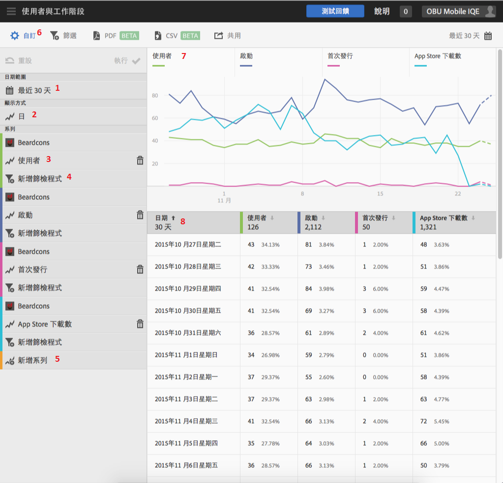

# Customize reports{#customize-reports}

此資訊能協助您瞭解及自訂內建的報表。

您可以透過變更日期範圍、**[!UICONTROL 「顯示方式」]選項 (依時段或依維度顯示圖形和表格資料)、新增量度和篩選器、新增其他系列 (量度) 等方式自訂報表。**

To display the Customize rail, click the name of the app to go to its Overview page, and click **[!UICONTROL Customize]**.

以下範例顯示開啟了「自訂」邊欄的「使用者與工作階段」報表。****&#x200B;此範例顯示最近 30 天的資料，依日數顯示，且有四個使用中系統:

* **[!UICONTROL 使用者]**
* **[!UICONTROL 啟動]**
* **[!UICONTROL 首次啟動]**
* **[!UICONTROL App Store 下載數]**

以下資訊說明報表的每個區域以及&#x200B;**[!UICONTROL 自訂]邊欄:**

| 數量 | 說明 |
|--- |--- |
| 1 | In **[!UICONTROL Date Ranges]**, the drop-down list lets you select various date ranges for your report. 圖表 (9) 和對應表格 (10) 中的所有資料都遵照選取的日期範圍。 |
| 2 | In **[!UICONTROL Show By]**, the drop-down list lets you select a time-based or dimension-based display for your report.  例如，在上圖中，您可以看到已選取「天」。如果查看圖表 (7) 下方的日期以及表格 (8) 中的列，資料是依時相報表中的日期分類。您可以在時相報表中加入更多系列，此報表最多可報告六個量度。如果選取生命週期維度，您可以檢視排名清單中的前 50 個值、日趨勢或週趨勢前 5 名的值，或是前 5 名或前 10 名劃分的值。 |
| 3 | **[!UICONTROL 系列]**&#x200B;代表個別量度，例如上述範例中的使用者、啟動、首次啟動和應用程式商店下載。每個系列都以色彩標示圖表 (7) 和表格 (8) 中的資料。您可以新增其他系列 (量度)，甚至是不同報表套裝中的其他應用程式來比較資料。For more information, see  [Add Series (Metrics) to Reports](/help/using/usage/reports-customize/t-reports-series.md). |
| 4 | With **[!UICONTROL Add Filter]**, you can customize the built-in reports by adding additional filters (segments).  如需詳細資訊，請參 [閱新增篩選器至報表](/help/using/usage/reports-customize/t-reports-customize.md)。 |
| 5 | With **[!UICONTROL Add Series]**, you can customize the built-in reports by adding additional series (metrics) or apps in different report suites to compare data.  For more information, see Add Series (Metrics) to Reports. |
| 6 | With **[!UICONTROL Sticky Filter]**, you can create a filter that spans different reports. 您想要查看特定區段在所有行動報表中的表現情形時即可使用。嚴格篩選可讓您定義套用到所有非路徑報表的篩選器。如需詳細資訊，請參 [閱新增嚴格篩選](/help/using/usage/reports-customize/t-sticky-filter.md)。 |
| 7 | **「資料圖表」會根據所選量度在適當的圖表中顯示資料。**&#x200B;圖表類型包括折線圖、橫條圖、環圈圖等。 |
| 8 | **[!UICONTROL 「日期表格」]會以表格形式顯示資料。**&#x200B;您可以按一下任何欄標題，依遞增或遞減順序排序資料。 |

