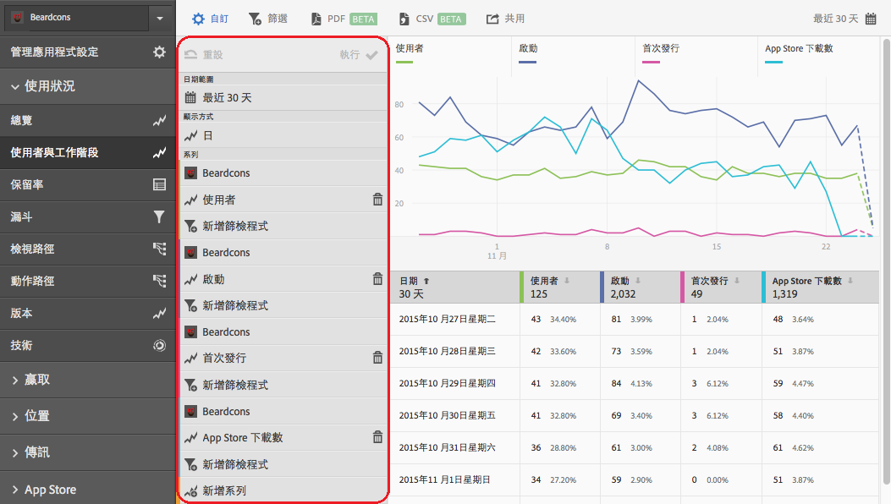

# Add filters to reports{#add-filters-to-reports}

這些資訊可協助您透過新增其他篩選器 (區段) 來自訂內建報表。

>[!IMPORTANT]
>
>行銷報告與分析、臨機分析、資料倉庫和其他Analytics報告介面中也提供行動應用程式量度。如果 Adobe Mobile 中沒有某劃分或報表類型，表示可能是使用其他報表介面所產生。

這些指示適用於任何報表，在此例中，我們以自訂&#x200B;**[!UICONTROL 「使用者與工作階段」]報表進行示範。**

1. Open your app and click **[!UICONTROL Usage]** &gt; **[!UICONTROL Users &amp; Sessions]**.

   

   此報表可提供應用程式使用者隨著時間改變的完整檢視。不過，此應用程式 iOS 和 Android 版的量度都會收集到同一報表套裝中。我們可以新增自訂篩選器至「使用者」量度，並依行動裝置的作業系統來區分使用者。

1. Click **[!UICONTROL Customize]**.

   

1. Under **[!UICONTROL Users]**, click **[!UICONTROL Add Filter]** and click **[!UICONTROL Add Rule]**.

1. Select **[!UICONTROL Operating Systems]**, and from the drop-down list, and select **[!UICONTROL iOS]**.

   

   若要新增Android做為篩選器，您必須重復此步驟。

1. Click **[!UICONTROL And]**, select **[!UICONTROL Operating Systems]** from the drop-down list, and select **[!UICONTROL Android]**.

   您的篩選器現在看起來應該類似下面的範例:

   

1. Click **[!UICONTROL Update]**.
1. To regenerate the report, click **[!UICONTROL Run]**.

   此報表現會顯示依作業系統劃分的使用者。報表標題已變更，以符合套用至報表的篩選器。

   

   您可以自訂此報告更多。從iOS8.3，您可以使用iOS8.3作業系統版本篩選器新增「首次啓動」度量，查看有多少iOS8.3客戶升級其應用程式並執行首次啓動。
1. Under **[!UICONTROL First Launches]**, click **[!UICONTROL Add Filter]**, click **[!UICONTROL Add Rule]**, select **[!UICONTROL Operating Systems]** from the drop-down list, and select **[!UICONTROL iOS]**.
1. Click **[!UICONTROL And]**, select **[!UICONTROL Operating System Versions]** from the drop-down list, and select **[!UICONTROL iOS 8.3]**.

   您的篩選器現在看起來應該類似以下範例:

   

1. Click **[!UICONTROL Update]** and **[!UICONTROL Run]**.

   此報表現會顯示第一次啟動應用程式的 iOS 8.3 使用者。

   

   花一些時間測試報表自訂選單上的不同選項，並且將您最喜愛的選項加入書籤。Adobe Mobile中的報表URL具有功能，可透過電子郵件傳送或新增至我的最愛。
