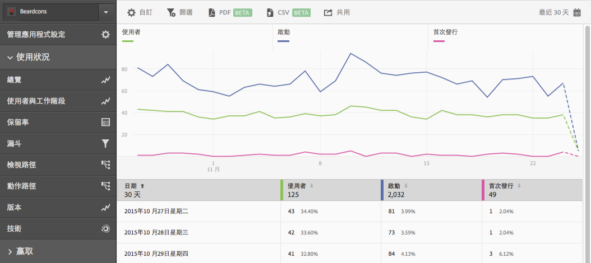

# 新增篩選器至報表{#add-filters-to-reports}

這些資訊可協助您透過新增其他篩選器 (區段) 來自訂內建報表。

>[!IMPORTANT]
>
>Marketing Reports &amp; Analytics、Ad Hoc Analysis、Data Warehouse 和其他 Analytics 報表介面中也有行動應用程式量度可以使用。如果 Adobe Mobile 中沒有某劃分或報表類型，表示可能是使用其他報表介面所產生。

這些指示適用於任何報表，在此例中，我們以自訂&#x200B;**[!UICONTROL 「使用者與工作階段」]**&#x200B;報表進行示範。

1. 開啟應用程式，然後依序按一下&#x200B;**[!UICONTROL 「使用狀況]** > **[!UICONTROL 使用者和工作階段」]**。

   

   此報表可提供應用程式使用者隨著時間改變的完整檢視。不過，此應用程式的 iOS 和 Android 版本的量度會收集在相同的報表套裝中。我們可以將自訂篩選器新增至「使用者」量度，以依據行動作業系統來劃分使用者。

1. 按一下&#x200B;**[!UICONTROL 自訂]**。

   

1. 在&#x200B;**[!UICONTROL 使用者]**&#x200B;下方，依序按一下&#x200B;**[!UICONTROL 新增篩選器]**&#x200B;和&#x200B;**[!UICONTROL 新增規則]**。

1. 選取&#x200B;**[!UICONTROL 作業系統]**，然後從下拉式清單中選取 **[!UICONTROL iOS]**。

   

   若要新增 Android 作為篩選器，您需要重複此步驟。

1. **[!UICONTROL 按一下和]**，從下拉式清單中選取&#x200B;**[!UICONTROL 作業系統]**，然後選取 **[!UICONTROL Android]**。

   您的篩選器現在看起來應該類似下面的範例:

   

1. 按一下&#x200B;**[!UICONTROL 更新]**。
1. 若要重新產生報表，請按一下&#x200B;**[!UICONTROL 執行]**。

   此報表現在會顯示依作業系統劃分的使用者。報表標題已變更，以符合套用至報表的篩選。

   

   您還可以進一步自訂此報表。自 iOS 8.3 起，您可以透過 iOS 8.3 作業系統版本篩選器新增「首次啟動」量度，以查看有多少 iOS 8.3 客戶升級應用程式並執行首次啟動。
1. 在&#x200B;**[!UICONTROL 首次啟動]**&#x200B;下方，依序按一下&#x200B;**[!UICONTROL 新增篩檢器]**&#x200B;和&#x200B;**[!UICONTROL 新增規則]**，從下拉式清單中選取&#x200B;**[!UICONTROL 作業系統]**，然後選取 **[!UICONTROL iOS]**。
1. **[!UICONTROL 按一下和]**，從下拉式清單中選取&#x200B;**[!UICONTROL 作業系統版本]**，然後選取 **[!UICONTROL iOS 8.3]**。

   您的篩選器現在看起來應該類似以下範例:

   

1. 按一下&#x200B;**[!UICONTROL 更新]**&#x200B;再按&#x200B;**[!UICONTROL 執行]**。

   此報表現在會顯示首次啟動應用程式的 iOS 8.3 使用者。

   

   請花點時間測試報表自訂功能表上的不同選項，並確實為您最常用的項目建立書籤。Adobe Mobile 中的報表 URL 功能完善，可以透過電子郵件傳送或加入您的最愛。
