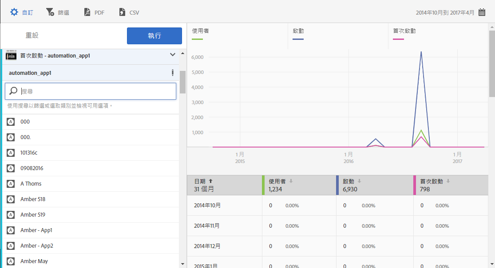

# 新增系列 (量度) 至報表{#add-series-metrics-to-reports}

這些資訊可讓您藉由新增其他系列 (量度) 或不同報表套裝中的應用程式來比較資料，進而自訂內建報表。

>[!IMPORTANT]
>
>Marketing Reports &amp; Analytics、Ad Hoc Analysis、Data Warehouse 和其他 Analytics 報表介面中也有行動應用程式量度可以使用。如果 Adobe Mobile 中沒有某劃分或報表類型，表示可能是使用其他報表介面所產生。

這些指示適用於任何報表，在此例中，我們以自訂&#x200B;**[!UICONTROL 使用者與工作階段]**&#x200B;報表進行示範。

1. 開啟應用程式，然後依序按一下&#x200B;**[!UICONTROL 使用狀況]** &gt; **[!UICONTROL 使用者和工作階段]**。

   

   此報表可提供應用程式使用者隨著時間改變的完整檢視。不過，我們還想新增系列來報告應用程式當機。

1. 按一下&#x200B;**[!UICONTROL 自訂]**。

   

1. 向下捲動並按一下&#x200B;**[!UICONTROL 新增系列]**。

   系統會以清單中最後一個系列的相同名稱，來填入系列的名稱。在上圖中，最新系列是&#x200B;**[!UICONTROL 應用程式商店下載數]**，表示已新增新系列並且將標題命名為&#x200B;**[!UICONTROL 應用程式商店下載數]**。

1. 完成下列其中一項作業:

   * 若要新增系列 (量度)，請按一下您剛建立的系列名稱，然後從下拉式清單中選取新的生命週期量度。

      

   * 若要新增位於不同報表套裝的應用程式，以便跨應用程式比較資料，請按一下新建立系列中的應用程式名稱，然後選取想要的應用程式。

      

1. (條件式) 新增篩選器至新系列。

   如需詳細資訊，請參閱[新增篩選器至報表](/help/using/usage/reports-customize/t-reports-customize.md)。
1. 按一下&#x200B;**[!UICONTROL 更新]**&#x200B;再按&#x200B;**[!UICONTROL 執行]**。
