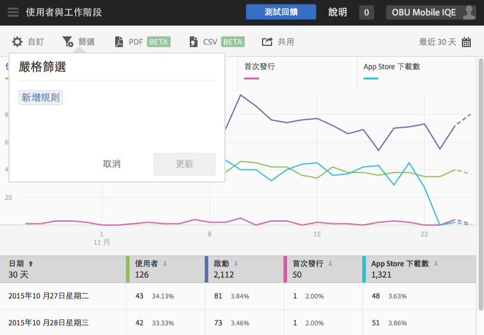
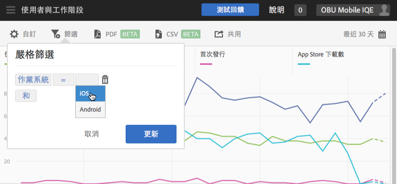
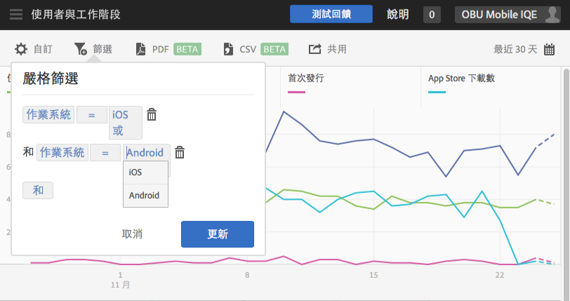

# 新增嚴格篩選{#add-sticky-filter}

建立跨越不同報表的篩選器，以查看特定區段在所有行動報表中的執行情形。嚴格篩選可讓您定義套用到所有非路徑報表的篩選器。

下列範例會新增 iOS 和 Android 作業系統的嚴格篩選至「**[!UICONTROL 使用者與工作階段]**」報表，但這些指示適用於任何報表。

1. 按一下 Adobe Mobile 中任何報表頂端的&#x200B;**[!UICONTROL 篩選]**&#x200B;圖示。

   

1. 在「嚴格篩選」對話方塊中，按一下&#x200B;**[!UICONTROL 新增規則]**，選取&#x200B;**[!UICONTROL 作業系統]**，然後從下拉式清單中選取 **[!UICONTROL iOS]**。

   若要新增 Android 作為篩選器，請重複此步驟。

   

1. **[!UICONTROL 按一下和]**，選取&#x200B;**[!UICONTROL 作業系統]**，然後從下拉式清單中選取 **[!UICONTROL Android]**。

   您的篩選器現在看起來應該類似下面的範例:

   

1. 按一下&#x200B;**[!UICONTROL 更新]**&#x200B;再按&#x200B;**[!UICONTROL 執行]**。
