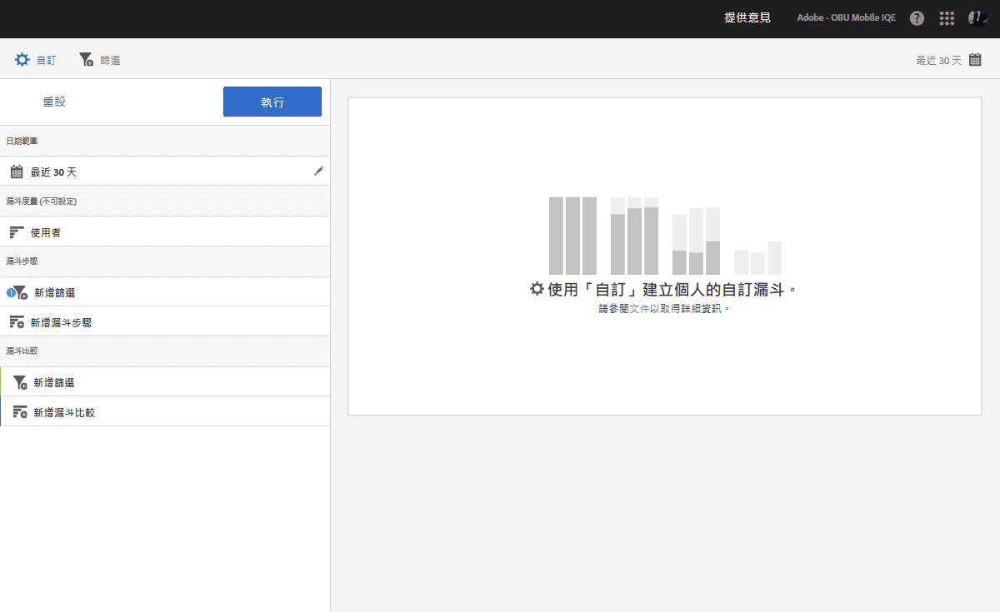

# 漏斗報表{#funnel}

**[!UICONTROL 漏斗]**&#x200B;報表可讓您識別客戶在與您的行動應用程式互動時，在哪個位置離開促銷活動或是從定義的轉換路徑轉向。您也可以使用&#x200B;**[!UICONTROL 「漏斗」]**&#x200B;報表來比較不同區段的動作。

洞察客戶在每個步驟的決策，可讓您瞭解他們在哪裡停住不再往前、傾向採取哪個路徑，以及何時離開您的應用程式。

如果要開啟&#x200B;**[!UICONTROL 「漏斗」]**&#x200B;報表，您必須建立自訂漏斗。如需詳細資訊，請參閱[自訂報表](/help/using/usage/reports-customize/reports-customize.md)。

>[!TIP]
>
>若要儲存自訂漏斗，請在配置設定以及執行報表後儲存 URL。您可以共用 URL 或將其儲存在文件中。

以下為此報表的範例:

為了展示簡單漏斗，以下顯示使用三個漏斗步驟和兩個漏斗比較的組態設定。我們假設示範應用程式可讓使用者新增項目 (例如相片)，然後加以分享。

在「自訂」視窗中，有些區段可指出使用者已啟動應用程式、從應用程式的圖庫新增相片、從應用程式分享一或多張相片至社交媒體、簡訊、電子郵件等。漏斗比較可讓您比較 iOS 應用程式使用者與 Android 應用程式使用者新增和分享相片的層級。

若要產生報表，請按一下&#x200B;**[!UICONTROL 執行]**。

以下是產生報表的範例：

第一個序列顯示有 100% 的使用者已啟動應用程式。第二個序列顯示有較高比例的 Android 使用者從圖庫新增了相片。第三個序列顯示幾乎有一半的 iOS 使用者分享了相片，但是沒有任何 Android 使用者分享相片。這可能表示應用程式有問題，需要進行調查。

若要顯示其他資訊，請將滑鼠移至圖表中的任何長條上方。

您可以為此報表配置下列選項:

* **[!UICONTROL 時段]**

   按一下&#x200B;**[!UICONTROL 「日曆」]**&#x200B;圖示以選取自訂時段，或從下拉式清單中選擇預設時段。
* **[!UICONTROL 自訂]**

   您可以透過變更&#x200B;**[!UICONTROL 「顯示方式」]**&#x200B;選項、新增量度和篩選器以及新增其他系列 (量度) 等方式來自訂報表.如需詳細資訊，請參閱[自訂報表](/help/using/usage/reports-customize/reports-customize.md)。
* **[!UICONTROL 篩選]**

   按一下&#x200B;**[!UICONTROL 「篩選」]**&#x200B;可以建立跨越不同報表的篩選器，以查看在所有行動報表中的表現情形。嚴格篩選可讓您定義套用到所有非路徑報表的篩選器。如需詳細資訊，請參閱[新增嚴格篩選](/help/using/usage/reports-customize/t-sticky-filter.md)。
* **[!UICONTROL 下載]**

   按一下 **[!UICONTROL PDF]** 或 **[!UICONTROL CSV]** 可下載或開啟文件，以及分享給無法存取 Mobile Services 的使用者，或是在簡報中使用檔案。
