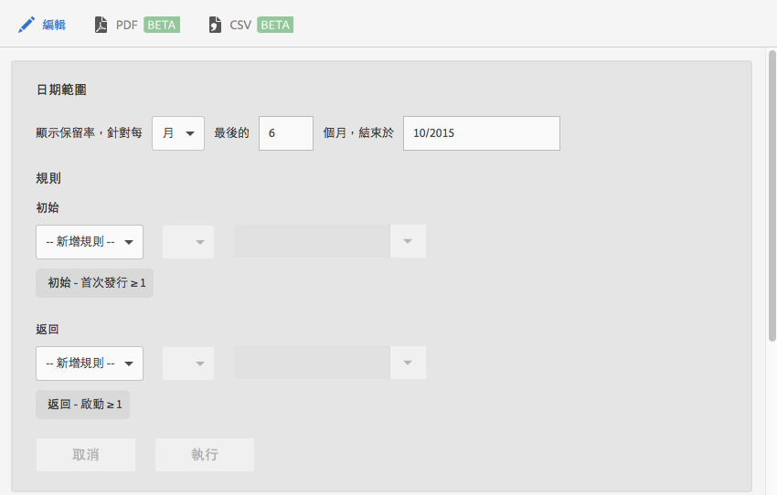

# 保留報表 {#retention}

**[!UICONTROL 保留]**&#x200B;報表 (舊稱為「首次啟動的群眾」) 是群眾報表，可顯示有多少不重複使用者初次啟動您的應用程式，並且在隨後的幾個月內至少再啟動一次您的應用程式。

此報表預設會根據使用者首次啟動應用程式的時間，顯示使用者群組的保留率。您也可以自訂此報表，使用「首次啟動」以外的量度，並新增其他動作。

群眾是指定義期間有共同特徵或體驗的一群人。**[!UICONTROL 保留]**&#x200B;報表採取在特定日、週和月份安裝應用程式之使用者的共同特性，然後繪製有多少使用者在接下來 X 天、X 週或 X 月內啟動應用程式的圖表。報表會顯示訪客的活動或參與程度。

以下為此報表的範例:

**[!UICONTROL 「MO」]**&#x200B;欄中顯示在 2014 年 11 月初次啟動應用程式的使用者總人數。**[!UICONTROL 「M1」]**&#x200B;欄中則顯示 2014 年 12 月再次啟動應用程式的使用者人數，以此類推。

若要變更日期範圍或編輯報表規則，請按一下&#x200B;**[!UICONTROL 編輯]**。

報表可以填入任何變數或量度，包括生命週期量度 (但不含計算量度)。
