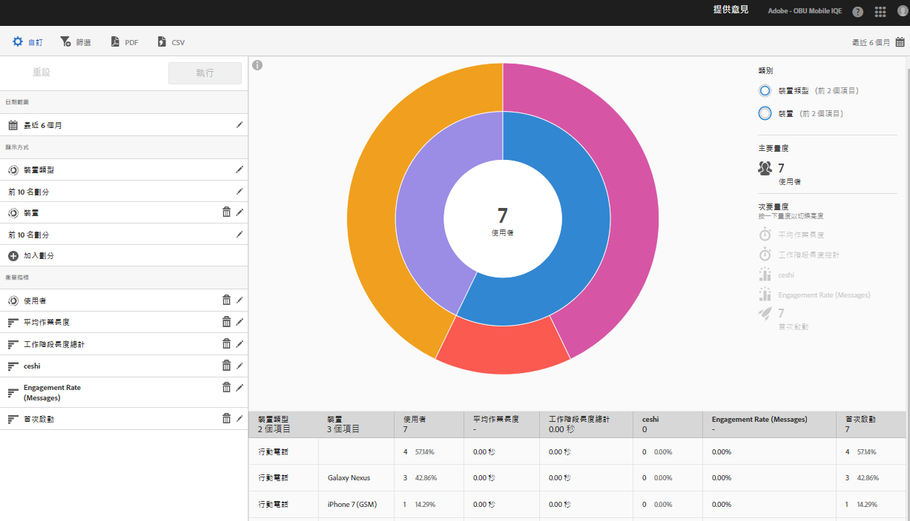

# 技術報表 {#technology}

**[!UICONTROL 「技術」]**&#x200B;報表可讓您查看使用您應用程式的不同裝置類型、作業系統、作業系統版本，以及行動電信業者。

此報表以散射環視覺效果呈現您現有的資料，而您可以利用該報表探索目標的對象段 (訪客群)。建立及管理對象類似於建立及使用區段，但無法在 Experience Cloud 之中建立對象。

## 導覽及使用狀況 {#section_83CA60E1AE6245FEBCBFF3205615C4DF}

此視覺化提供例如基本報表和劃分，使用高度來顯示焦點中的量度，以及量度之間的效能差異。 每個鈴聲代表鈴聲類別中的觀眾區隔。 您可以對對象採取動作，例如套用嚴格篩選、隱藏量度和檢視量度。

>[!TIP]
>
>除了此資訊外，您也可以檢視產品內的教學課程，該教學課程會說明如何與散射環圖互動。若要啟動教學課程，請按一下報表標題列中的&#x200B;**[!UICONTROL 技術劃分]**，然後依序按一下&#x200B;**[!UICONTROL 自訂]**&#x200B;和 **[!UICONTROL i]** 圖示。

散射環圖是互動式的，您可以完成下列工作：

* 將滑鼠移至圖表的任一部分，以顯示更多資訊。
* 按一下&#x200B;**[!UICONTROL 「行事曆」]**&#x200B;圖示可變更時段。
* 按一下散射環中的某一塊以選取對象，接著您可以對其執行動作，例如放大顯示、隱藏對象，以及建立應用程式內訊息或嚴格篩選。
* 選取右上角的&#x200B;**[!UICONTROL 「裝置類型」]**&#x200B;和&#x200B;**[!UICONTROL 「裝置」]**，即可檢視有關裝置和裝置類型的資訊。

* 按一下右側的次要量度，將其新增至視覺化。

   您可以使用顏色、高度或兩者來顯示次要量度。

下表說明標準報表，以及在 Mobile Services 中如何填入標準報表:

| 報表 | 人口方法 | 說明 |
|--- |--- |--- |
| 裝置 | 生命週期量度 | 依裝置類型劃分的通用量度。 |
| 作業系統 | 自動 | 依作業系統劃分的通用量度。 |
| 作業系統版本 | 生命週期量度 | 依作業系統版本劃分的通用量度。 |
| 電信業者 | 自動 | 依電信業者劃分的通用量度。 |

>[!TIP]
>
>在&#x200B;**[!UICONTROL 電信業者]**&#x200B;報表中，將 Wi-Fi 使用者報告為 `none`。

## 加入劃分和量度 {#section_15833511E82648869E7B1EFC24EF7B82}

您可以加入劃分和次要量度，這會變更每個對象相對於圖表中其他對象的高度。

>[!IMPORTANT]
>
>散射環中的環數越多，處理的時間就越久。

若要加入劃分和次要量度，請按一下報表標題列中的&#x200B;**[!UICONTROL 技術劃分]**，然後按一下&#x200B;**[!UICONTROL 自訂]**。

當您按一下&#x200B;**[!UICONTROL 加入劃分]**&#x200B;或&#x200B;**[!UICONTROL 新增量度]**，相應清單中就會出現一個名稱與前一個項目相同的新項目。按一下新建立的劃分或量度，可存取一個下拉式清單並從中選取新項目。

## 建立嚴格篩選 {#section_B4E355CD1FE34E4C8ADC38139ED67FC8}

按一下散射環中的某一塊，可以選取您要對其建立嚴格篩選的對象，然後按一下&#x200B;**[!UICONTROL 嚴格篩選]**。此篩選可讓您套用目前的篩選，並根據篩選執行新報表。

## 共用報表 {#section_560DD5CED5144249B7E49461E2422100}

建立報表後，系統會使用您的設定建立自訂 URL，以供您複製和分享。
