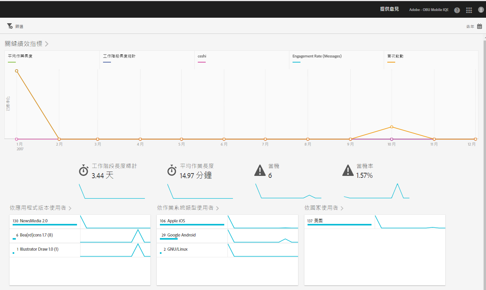

# 概觀報告{#overview}

「概述」報表可提供關鍵量度的快照。

以下為此報表的範例:

按一下右上角的「行事曆」圖示，即可變更報表的日期範圍。您也可以建立跨越不同報告的嚴格篩選，以查看區段在所有行動報表中的表現情形。如需建立嚴格篩選的詳細資訊，請參閱 [新增嚴格篩選](/help/using/usage/reports-customize/t-sticky-filter.md)。

>[!TIP]
>
>您可以在建立應用程式時，設定此報表的關鍵度量。如需詳細資訊，請參閱 [設定您的應用程式](/help/using/c-manage-app-settings/c-mob-confg-app/c-mob-confg-app.md)。

