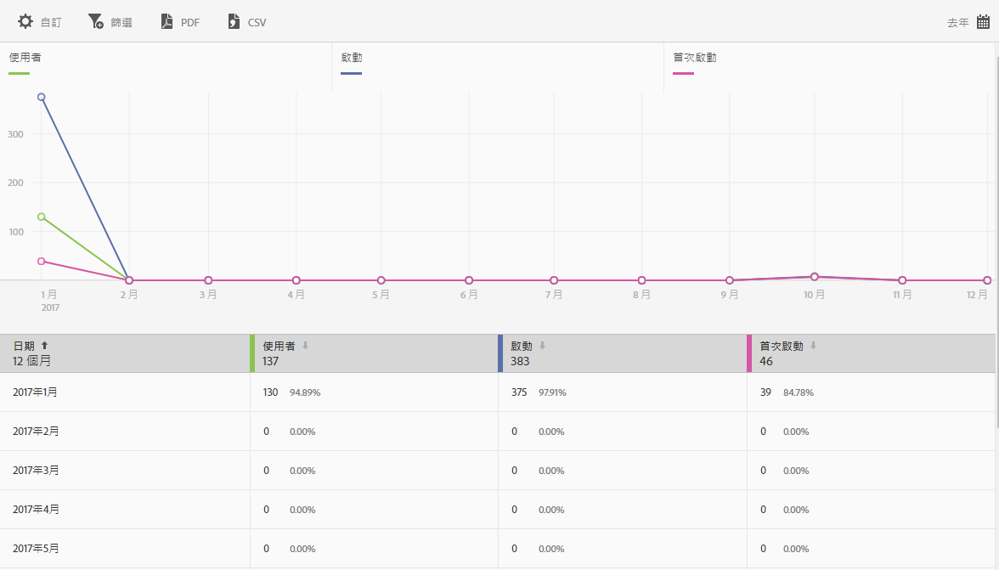

# 使用者與工作階段報表{#users-and-sessions}

{#eol}

「使用者與工作階段」報表會顯示所選時間範圍內不重複訪客的量度。

您可以為此報表配置下列選項:

* **[!UICONTROL 時段]**

   按一下&#x200B;**[!UICONTROL 「日曆」]**&#x200B;圖示以選取自訂時段，或從下拉式清單中選擇預設時段。

* **[!UICONTROL 自訂]**

   您可以透過變更&#x200B;**[!UICONTROL 「顯示方式」]**&#x200B;選項、新增量度和篩選器以及新增其他系列 (量度) 等方式來自訂報表.如需詳細資訊，請參閱[自訂報表](/help/using/usage/reports-customize/t-reports-customize.md)。

* **[!UICONTROL 篩選]**

   按一下&#x200B;**[!UICONTROL 「篩選」]**&#x200B;可以建立跨越不同報表的篩選器，以查看在所有行動報表中的表現情形。嚴格篩選可讓您定義套用到所有非路徑報表的篩選器。如需詳細資訊，請參閱[新增嚴格篩選](/help/using/usage/reports-customize/t-sticky-filter.md)。

* **[!UICONTROL 下載]**

   按一下 **[!UICONTROL PDF]** 或 **[!UICONTROL CSV]** 可下載或開啟文件，以及分享給無法存取 Mobile Services 的使用者，或是在簡報中使用檔案。
