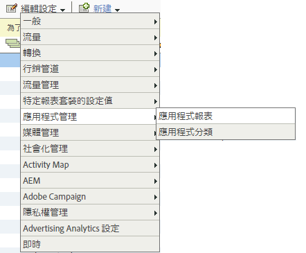

# 分析 {#analytics}

將庫添加到項目後，您可以在應用的任何位置調用任何Analytics方法。

>[!TIP]
>
>確保導入 `ADBMobile.h` 你的課。

## 在分析中啟用移動應用程式報告 {#section_F2F9234009184F20BA36B5CDE872B424}

在添加代碼之前，請讓分析管理員完成以下操作以啟用Mobile應用程式生命週期跟蹤。 這可確保您的報告套件在您開始開發時能夠捕獲度量。

1. 開啟 **[!UICONTROL 管理工具]** > **[!UICONTROL 報表套件]** 並選擇移動報告套件。
1. 按一下 **[!UICONTROL 編輯設定]** > **[!UICONTROL Mobile管理]** > **[!UICONTROL Mobile應用程式報告]**。

   

1. 按一下 **[!UICONTROL 啟用最新應用報告]**。

   （可選）您也可以按一下 **[!UICONTROL 啟用Mobile位置跟蹤]** 和 **[!UICONTROL 為背景點擊啟用舊式報告和屬性]**。

   

生命週期指標現在已準備好捕獲，而Mobile應用程式報告將顯示在 **[!UICONTROL 報告]** 的子菜單。

### 新版本

定期發佈新版本的移動應用程式報告。 新版本不會自動應用於報表套件，您必須重複這些步驟才能執行升級。 每次向應用添加新的Experience Cloud功能時，我們建議重複這些步驟以確保您擁有最新的配置。

## 生命週期量度 {#section_532702562A7A43809407C9A2CBA80E1E}

要收集應用程式中的生命週期度量，請在激活應用程式時添加調用，如以下示例所示。

### 預設為.js的WinJS

```js
app.onactivated = function (args) { 
  if (args.detail.kind === activation.ActivationKind.launch) { 
   ... 
   // launched and resumed stuff  
   ADBMobile.Config.collectLifecycleData(); 
  } 
}; 
app.oncheckpoint = function (args) { 
  ADBMobile.Config.pauseCollectingLifecycleData(); 
}
```

### App.xaml.cs中的C#

```csharp
public App() 
{ 
    this.InitializeComponent(); 
    this.Resuming *= OnResuming; 
    this.Suspending *= OnSuspending; 
} 
protected override void OnLaunched(LaunchActivatedEventArgs e) 
{ 
    ... 
    ADBMobile.Config.CollectLifecycleData(); 
    ... 
} 
private void OnResuming(object sender, object e) 
{ 
    ... 
    ADBMobile.Config.CollectLifecycleData(); 
    ... 
} 
private void OnSuspending(object sender, SuspendingEventArgs e) 
{ 
    ... 
    ADBMobile.Config.PauseCollectingLifecycleData(); 
    ... 
}
```

### App.xaml.cpp中的C/CX

```c
App::App() 
{ 
 InitializeComponent(); 
 Resuming *= ref new EventHandler<Object ^>(this, &App::OnResuming); 
 Suspending *= ref new SuspendingEventHandler(this, &App::OnSuspending); 
} 
void App::OnResuming(Object ^sender, Object ^args) 
{ 
 ... 
 ADBMobile::Config::CollectLifecycleData(); 
 ... 
} 
void App::OnSuspending(Object^ sender, SuspendingEventArgs^ e) 
{ 
 ... 
 ADBMobile::Config::PauseCollectingLifecycleData(); 
 ... 
} 
void App::OnLaunched(Windows::ApplicationModel::Activation::LaunchActivatedEventArgs^ e) 
{ 
 ... 
 ADBMobile::Config::CollectLifecycleData(); 
 ... 
}
```

如果 `CollectLifecycleData()` 在同一會話中調用兩次，然後您的應用程式將在第一次呼叫後報告每次呼叫的崩潰。 當應用程式關閉時，SDK會設定一個標誌，指示成功退出。 如果未設定此標誌， `CollectLifecyleData()` 報告了車禍。

## 事件、Prop 以及 eVar {#section_76EA6F5611184C5CAE6E62956D84D7B6}

如果你看過 [ADBMobile類和方法參考](/help/windows-appstore/c-configuration/methods.md)你可能在想，該在哪裡設定活動、電視、道具、繼承人和清單。 在版本4中，您無法再直接在應用程式中分配這些類型的變數。 SDK 會改為使用內容資料和處理規則，將應用程式資料對應至 Analytics 變數以便報告。

處理規則提供了以下幾個優點：

* 您可以直接變更資料對應，而無須將更新提交至 App Store。
* 您可以用有意義的資料名稱，取代設定報表套裝專用的變數。
* 對傳送額外資料的影響極小。在使用處理規則映射這些值之前，這些值不會出現在報表中。

應將您直接分配給變數的任何值添加到上下文資料。

## 處理規則 {#section_66EE762EEA5E4728864166201617DEBF}

處理規則用於將上下文資料變數中發送的資料複製到報表的變數、屬性和其他變數。

[處理規則概觀](https://experienceleague.adobe.com/docs/analytics/admin/admin-tools/processing-rules/processing-rules.html)

Adobe建議使用「命名空間」對上下文資料變數進行分組，因為它有助於保持邏輯順序。 例如，如果要收集有關產品的資訊，可以定義以下變數：

```js
"product.type":"hat";
"product.team":"mariners";
"product.color":"blue";
```

上下文資料變數在處理規則介面中按字母順序排序，因此命名空間使您能夠快速查看同一命名空間中的變數。

另外，我們聽說您中的一些人正在使用eVar或prop編號命名上下文資料鍵：

```js
"eVar1":"jimbo";
```

這可能會使 *略微* 在處理規則中執行一次性映射時更容易，但在調試過程中會丟失可讀性，而將來的代碼更新則會更加困難。 相反，我們強烈建議對鍵和值使用描述性名稱：

```js
"username":"jimbo";
```

將定義計數器事件的上下文變數設定為值「1」：

```js
"logon":"1";
```

定義增量事件的上下文資料變數可以具有增量值：

```js
"levels completed":"6";
```

>[!NOTE]
>
>Adobe 會保留命名空間 `a.`。除了這些小的限制外，上下文資料變數在登錄公司中必須是唯一的，以避免衝突。

## Products 變數 {#section_AFBA36F3718C44D29AF81B9E1056A1B4}

設定 *`products`* 在移動SDK中，必須使用特殊語法。 請參閱 [產品變數](/help/windows-appstore/analytics/products/products.md)。

## （可選）啟用離線跟蹤 {#section_955B2A03EB854742BDFC4A0A3C287009}

要在設備離線時儲存命中，可以在 [ADBMobileConfig.json配置](/help/windows-appstore/c-configuration/methods.md)。 在啟用離線跟蹤之前，請注意配置檔案引用中描述的時間戳要求。

## 地理位置與地標 {#section_BAD34A8DD013454DB355121316BD7FD4}

地理位置允許您測量位置資料（經緯度）和預定義的感興趣點。 每個 `TrackLocation` 呼叫發送：

* 緯度/經度和POI(如果在 `ADBMobileConfig.json` 配置檔案)。 這些變數將傳遞給移動解決方案變數以便自動報告。
* 與中心的距離和作為上下文資料傳遞的精度。 使用處理規則捕獲。

要跟蹤位置，請執行以下操作：

```js
var ADB = ADBMobile; 
ADB.Analytics.trackLocation(37.75345, -122.33207, null);
```

如果以下POI是在 `ADBMobileConfig.json` 配置檔案：

```js
"poi" : [ 
            ["San Francisco",37.757144,-122.44812,7000], 
        ]
```

當設備位置被確定為在限定點的7000米半徑內時， `a.loc.poi` 值為「舊金山」的上下文資料變數與 `TrackLocation` 擊中。 安 `a.loc.dist` 上下文變數以距離定義的坐標的米為單位發送。

## 生存期值 {#section_D2C6971545BA4D639FBE07F13EF08895}

期限值可讓您測量每個使用者的期限值並將其設為目標。每次您以 `TrackLifetimeValueIncrease` 傳送一個值時，就會將該值新增至現有值。期限值儲存在裝置上，且可透過呼叫 `GetLifetimeValue` 隨時擷取。此值可用來儲存期限購買數、廣告檢視次數、視訊完成次數、社交分享和照片上傳數等等。

```js
// Lifetime Value Example 
var ADB = ADBMobile; 
var purchasePrice = 39.95; 
var cdata = new Windows.Foundation.Collections.PropertySet(); 
cdata["ItemPurchaseEvent"] = "ItemPurchaseEvent"; 
cdata["PurchaseItem"] = "Item453"; 
cdata["PurchasePrice"] = purchasePrice; 
ADB.Analytics.trackLifetimeValueIncrease(purchasePrice, cdata);
```

## 計時動作  {#section_7FF8B6A913A0460EAA4CAE835E32D8C1}

定時操作允許您測量操作開始和結束之間的應用內時間和總時間。 SDK計算會話中的時間量和完成操作所花費的總時間（跨會話）。 這可用於定義要按購買時間、通過級別、結帳流程等進行比較的段。

* 從開始到結束期間停留在應用程式內的總秒數 (跨工作階段)
* 從開始到結束的總秒數 (時鐘時間)

```js
// Timed Action Start Example 
var ADB = ADBMobile; 
var cdata = new Windows.Foundation.Collections.PropertySet(); 
cdata["ExperienceName"] = experience; 
ADB.Analytics.trackTimedActionStart("TimeUntilPurchase", cdata);
```

```js
// Timed Action Update Example 
var ADB = ADBMobile; 
var cdataUpdate = new Windows.Foundation.Collections.PropertySet(); 
cdataUpdate["ImageLiked"] = imageName; 
ADB.Analytics.trackTimedActionStart("TimeUntilPurchase", cdata); 
```

```js
// Timed Action End Example 
var ADB = ADBMobile; 
ADB.Analytics.trackTimedActionEnd("TimeUntilPurchase");
```
