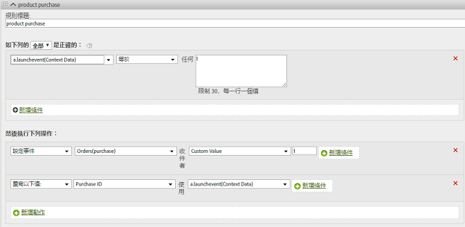

# Products variable{#products-variable}

您無法透過處理規則設定產品變數。在行動 SDK 中，您必須在內容資料參數中使用特殊語法，以直接在伺服器呼叫上設定產品。

若要設定 *`products`* 變數，請設定上下文資料索引鍵， `"&&products"`並使用定義的語法來設定值 *`products`*：

```js
cdata["&&products"] = "Category;Product;Quantity;Price[,Category;Product;Quantity;Price]";
```

例如:

```js
//create a context data dictionary 
var cdata = new Windows.Foundation.Collections.PropertySet(); 
 
// add products, a purchase id, a purchase context data key, and any other data you want to collect. 
// Note the special syntax for products 
cdata["&&products"] = ";Running Shoes;1;69.95,;Running Socks;10;29.99"; 
cdata["m.purchaseid"] = "1234567890"; 
cdata["m.purchase"] = "1"; 
 
var ADB = ADBMobile; 
// send the tracking call - use either a trackAction or TrackState call. 
// trackAction example: 
ADB.Analytics.trackAction("purchase", cdata); 
// trackState example: 
ADB.Analytics.trackState("Order Confirmation", cdata);
```

*`products`* 是直接在影像要求上設定的，而其他變數則設為內容資料. 所有內容資料變數都必須透過處理規則對應:



您不需要使用處理規則對應 *`products`* 變數，因為它是由SDK直接在影像要求上設定。
